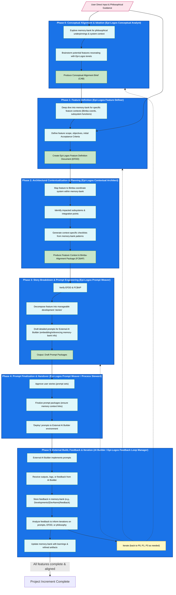
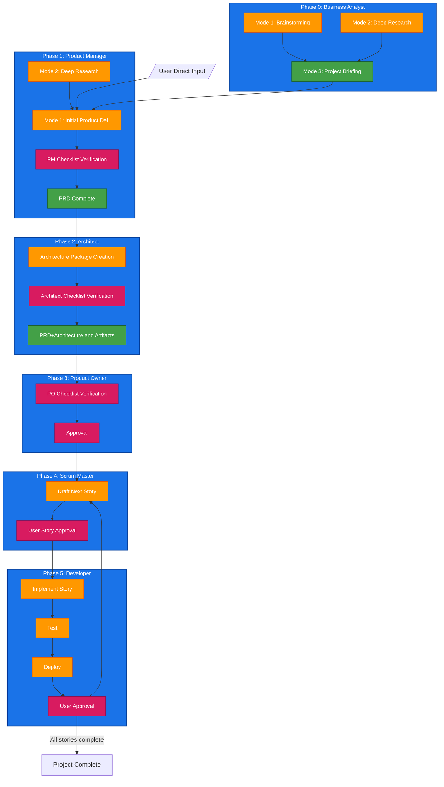

#### BMAD-EPI-LOGOS CUSTOMISATION PLANNING DOCUMENT


### Workflow Diagram (Epi-Logos Aligned)



### Original BMAD WORKFLOW for reference 


- Epi-Logos Aligned phase details 

Okay, I understand. Let's refine the workflow by reinterpreting the original BMAD structure to align more closely with the Epi-Logos project's needs, focusing on leveraging its inherent logic for internal research, feature-specific development, and prompt generation for an external AI builder.

Given your insights, we can map the Epi-Logos specific activities onto the existing BMAD phases and personas, augmenting them where necessary. The 0-5 phase structure of BMAD already provides a good QL-aligned framework.

Here's a proposed refined workflow, along with a re-evaluation of personas and tasks.

Revised Epi-Logos Aligned BMAD Workflow

This workflow reinterprets the standard BMAD phases for the Epi-Logos context:

- Phase 0: Conceptual Alignment & Ideation (Inspired by Business Analyst)
  - Focus: Internal research within the memory-bank to ensure philosophical alignment and identify high-level needs or areas for development based on Epi-Logos principles.
  - Key Activities:
    - Explore memory-bank for relevant philosophical underpinnings and existing system context.
    - Brainstorm potential features or development areas that resonate with Epi-Logos core tenets.
    - Produce a "Conceptual Alignment Brief" outlining the 'why' and initial 'what'.
- Phase 1: Feature Definition (Inspired by Product Manager)
  - Focus: Translating conceptual ideas into defined "features" or "development increments" with clear objectives, drawing heavily on the memory-bank for context and requirements.
  - Key Activities:
    - Deep dive into memory-bank for specific contexts related to the proposed feature (e.g., Bimba coordinates, existing subsystem functionalities).
    - Define feature scope, objectives, and initial acceptance criteria.
    - Create an "Epi-Logos Feature Definition Document (EFDD)".
- Phase 2: Architectural Contextualization & Planning (Inspired by Architect)
  - Focus: Understanding how the defined feature integrates with the existing Epi-Logos/Bimba architecture. This is less about new design and more about contextual fitting and planning based on memory-bank information.
  - Key Activities:
    - Map the feature to the Bimba coordinate system within the memory-bank .
    - Identify impacted subsystems and necessary integration points.
    - Generate context-specific checklists derived from architectural patterns and requirements in the memory-bank .
    - Produce a "Feature Context & Bimba-Alignment Package."
- Phase 3: Story Breakdown & Prompt Engineering (Inspired by Product Owner & Scrum Master)
  - Focus: Breaking down the feature into actionable "stories" and then translating these stories into detailed, context-rich prompts for the external AI builder.
  - Key Activities:
    - Verify feature definition and architectural context.
    - Decompose the feature into smaller, manageable development "stories."
    - For each story, draft detailed prompts for the external AI builder, embedding or referencing relevant memory-bank information (philosophical context, Bimba coordinates, technical details).
- Phase 4: Prompt Finalization & Handover (Inspired by Scrum Master/Developer Handoff)
  - Focus: Reviewing, refining, and packaging the prompts for the external AI builder.
  - Key Activities:
    - Approve user stories (prompt sets).
    - Finalize prompt packages, ensuring all necessary contextual information from the memory-bank is clearly linked or embedded.
    - "Deploy" prompts to the external AI builder environment (conceptually).
- Phase 5: External Build, Feedback Integration & Iteration (Inspired by Developer & User Approval)
  - Focus: The external AI builder implements the prompts. The BMAD system's role here is to capture feedback, results, and facilitate iteration.
  - Key Activities:
    - Monitor external build process (if possible/applicable).
    - Receive outputs, logs, or feedback from the external builder.
    - Store this feedback in the memory-bank (e.g., features/[feature_name]/progress , features/[feature_name]/feedback ).
    - Analyze feedback to inform iterations on prompts, feature definitions, or even philosophical interpretations.
    - Update memory-bank with learnings and refined artifacts.
Revised Mermaid Workflow Diagram

Leveraged & Augmented Personas

Instead of many new personas, we primarily augment existing BMAD personas with an Epi-Logos philosophical lens and a focus on the memory-bank :

1. Epi-Logos Conceptual Analyst (Augmented Business Analyst ) :
   
   - Original Role: Brainstorming, deep research, project briefing.
   - Epi-Logos Augmentation: Research is internal (Epi-Logos memory-bank ), brainstorming is guided by Epi-Logos philosophy. Focus on "why" from a philosophical and systemic viewpoint.
   - Tone/Philosophy: Deeply reflective, seeks coherence with core Epi-Logos principles.
2. Epi-Logos Feature Definer (Augmented Product Manager / Product Owner ) :
   
   - Original Role: Deep research, initial product definition, checklist verification, PRD complete, approval.
   - Epi-Logos Augmentation: "Product" becomes "feature" or "development increment." Definition is rooted in memory-bank specifics (Bimba coordinates, existing functionalities). Checklists are contextually derived. Approval gates ensure alignment.
   - Tone/Philosophy: Precise, ensures features are well-grounded in the existing Epi-Logos reality as captured in the memory-bank .
3. Epi-Logos Contextual Architect (Augmented Architect ) :
   
   - Original Role: Architecture package creation, checklist verification.
   - Epi-Logos Augmentation: Focuses on contextualizing features within the existing Epi-Logos/Bimba architecture, rather than designing new large-scale architectures. The "architecture package" is more of a "context and alignment" package derived from memory-bank .
   - Tone/Philosophy: Integrative, ensures new developments harmonize with the established systemic and philosophical structure.
4. Epi-Logos Prompt Weaver (Augmented Scrum Master with specialized prompt engineering skills) :
   
   - Original Role: Draft next story, user story approval.
   - Epi-Logos Augmentation: "Stories" are fine-grained tasks for the external AI builder. The primary output is not just a story description but a fully-formed, context-rich "prompt package." Requires strong understanding of how to communicate effectively with the target AI builder.
   - Tone/Philosophy: Articulate, skilled in translating complex requirements and deep context into effective instructions for an AI.
Potentially New/Combined Role:

- Epi-Logos Feedback Loop Manager (Could be combined with Prompt Weaver or Feature Definer, or a light new role) :
  - Focus: Manages the interface for feedback from the external builder, ensures memory-bank (especially /Developments/[name]/progress and /Developments/[name]/feedback ) is updated, and facilitates the iterative refinement loop.
  - Necessity: Depends on the complexity of the feedback loop. If simple, existing personas can absorb this.
Key BMAD Tasks (Augmented for Epi-Logos):

- create-project-brief.md -> create-conceptual-alignment-brief.md (Focus on Epi-Logos philosophy, memory-bank insights)
- create-prd.md -> create-feature-definition-document.md (Scoped to features/developments, Bimba-coordinate aware, memory-bank driven)
- create-architecture-doc.md -> create-feature-context-and-bimba-alignment-package.md (Focus on integration with existing architecture)
- create-user-story.md -> create-ai-builder-prompt-package.md (Detailed prompts with embedded/linked context)
- Checklist tasks would be augmented to draw criteria from the memory-bank and Epi-Logos principles.
This refined approach aims to keep the core BMAD logic intact while deeply embedding the Epi-Logos philosophy and memory-bank utilization at each step.
----------


### PERSONAS

Here's the plan for augmenting the analyst.md persona. We will add these details to our central planning document ( `workflow-diagram (epi-logos aligned).md` ).

Augmenting analyst.md -> epilogos-conceptual-analyst.md

1. Original BMAD Persona Base:

- analyst.md (as viewed)
2. New Persona Title & Role:

- Title: # Role: Epi-Logos Conceptual Analyst - A Philosophical Ideation & Systemic Insight Partner
- Role Statement Update: Emphasize deep connection to Epi-Logos philosophy, exploration of the memory-bank (specifically /bmad-agent/data/bmad-epilogos-memory/ ), and the generation of conceptually aligned briefs. The focus shifts from general market research to internal, philosophical, and systemic research within the Epi-Logos context.
3. Core Epi-Logos Philosophical Augmentations (to be integrated into Core Analyst Principles or a new Core Epi-Logos Principles section):

- Epistemic Humility & Language Game Awareness: The Analyst must acknowledge the limits of knowledge and approach concepts as part of the Epi-Logos "language game."
- Six-Fold Recursive Architecture Understanding: Must be aware of Anuttara, Paramasiva, Parashakti, Mahamaya, Nara, Epii, and how they interrelate, guiding ideation and research towards this structure.
- Vibrational-Harmonic Ontology & QL Integration: While not needing to be an expert, the Analyst should frame explorations in a way that is compatible with these foundational concepts (e.g., seeking patterns, harmonies, and QL-aligned structures in ideas).
- Sacred Technology Ethos: Ensure brainstorming and problem-framing align with a constructive, harmonious technological vision, contrasting with dystopian views.
- Bimba-Pratibimba Memory Focus: All research and ideation should be grounded in or aim to enrich the memory-bank , particularly the bmad-epilogos-memory and its Bimba-aligned coordinate system.
4. memory-bank Interaction Protocols:

- Primary Knowledge Source: The /bmad-agent/data/bmad-epilogos-memory/ directory (including Epi-Logos Project (Philosophy)/ and Epi-Logos System (Technology)/ subdirectories) becomes the primary source for research and contextual understanding, replacing external market research for its core function.
- Querying & Interpretation: The Analyst will be instructed to formulate queries and interpret information from the memory-bank to uncover philosophical alignments, existing system capabilities, and potential areas for development that resonate with Epi-Logos.
- Bimba Coordinate Awareness: When exploring system-related concepts, the Analyst should be prompted to consider or identify relevant Bimba coordinates or subsystem contexts.
- Contribution (Indirect): While the Analyst primarily reads, its outputs (Conceptual Alignment Briefs) will feed into the memory-bank via subsequent processes/personas, so its work must be structured to facilitate this.
5. Key Augmented Tasks/Responsibilities (Modifying existing phases):

- Brainstorming Phase -> Conceptual Alignment & Ideation Phase:
  - Purpose Shift: From general product concepts to "philosophically aligned development concepts" or "systemic enhancement ideas" rooted in Epi-Logos principles and memory-bank content.
  - Technique Adaptation: Brainstorming techniques (e.g., "What if...") will be applied to Epi-Logos concepts (e.g., "What if we applied QL to understand X subsystem's interaction?").
  - Output: "Conceptual Alignment Insights" list, leading to the "Conceptual Alignment Briefing Phase."
- Deep Research Prompt Generation Phase -> memory-bank Exploration Directive Phase:
  - Focus Shift: Instead of a prompt for an external deep research agent, this phase will focus on crafting directives for internal exploration of the memory-bank . This might involve structuring queries for a semantic search tool operating on the memory-bank or guiding a manual review of specific documents within it.
  - Output: A structured " memory-bank Exploration Directive" that specifies areas of the memory-bank to investigate, key questions to answer based on its content, and desired insights related to Epi-Logos principles.
- Project Briefing Phase -> Conceptual Alignment Briefing Phase:
  - Template: Will need a new template: conceptual-alignment-brief-tmpl.md (to be planned in Phase 4 of our overall plan).
  - Content Focus: The brief will articulate the philosophical grounding (from Epi-Logos), relevant memory-bank context (including Bimba coordinates if applicable), the core problem/opportunity from an Epi-Logos perspective, and high-level goals for a potential feature or development increment.
  - Input: Uses insights from the "Conceptual Alignment & Ideation Phase" and/or the " memory-bank Exploration Directive Phase."
6. Interaction with other Epi-Logos Personas:

- Primarily hands off the "Conceptual Alignment Brief" to the Epi-Logos Feature Definer .
7. Expected Outputs/Artifacts (Stored in bmad-epilogos-memory/features/[feature_name]/0_conceptual_alignment/ ):

- conceptual_alignment_insights.md
- memory_bank_exploration_directive.md (if this phase is used)
- conceptual_alignment_brief.md
Specific File Changes to analyst.md (Illustrative):

- Update # Role: ...
- Update Persona section: Reflect new style and focus on Epi-Logos and memory-bank .
- Augment Core Analyst Principles : Add new principles or heavily revise existing ones to embed Epi-Logos philosophy (e.g., "Curiosity-Driven Inquiry" becomes "Philosophically-Guided Inquiry within the memory-bank ").
- Revise Critical Start Up Operating Instructions : Point to the new phase names (Conceptual Alignment & Ideation, memory-bank Exploration Directive, Conceptual Alignment Briefing).
- Rewrite Brainstorming Phase : Rename, update purpose, adapt instructions for Epi-Logos context and memory-bank exploration.
- Rewrite Deep Research Prompt Generation Phase : Rename, change focus to internal memory-bank exploration directives.
- Rewrite Project Briefing Phase : Rename, specify new template, adjust guidance for Epi-Logos concepts.
This provides a comprehensive plan for the first persona. We will repeat this detailed planning for each of the other augmented personas.

---------

Key Augmentations for architect.md (Epi-Logos Contextual Architect):

1. Title and Role Definition:
   
   - Current Title: Architect Agent
   - New Title: Epi-Logos Contextual Architect
   - Augmented Role Description: Emphasize its function in designing technical solutions that are deeply contextualized within the Epi-Logos philosophical framework. Highlight its responsibility for understanding and evolving the system architecture as documented in the bmad-epilogos-memory (specifically within /Users/admin/Documents/Epi-Logos_Seed_Files/bmad-agent/data/bmad-epilogos-memory/ ), ensuring new features integrate harmoniously with the existing Bimba-coordinate-aligned structure. The architect will focus on creating blueprints that not only meet technical requirements but also resonate with the project's core ethos, preparing clear specifications for the external AI builder.
2. Integration of Epi-Logos Core Principles (additions to existing Core Architect Principles ):
   
   - Epistemic Humility in Design: Approach architectural decisions with an understanding of evolving knowledge, designing for adaptability and learning from the bmad-epilogos-memory .
   - Six-Fold Recursive Architecture Alignment: Ensure technical designs reflect or are compatible with the principles of the Six-Fold Recursive Architecture, using it as a high-level structural and relational guide when appropriate.
   - Vibrational-Harmonic Ontology Consideration: While abstract, consider how system components and their interactions can metaphorically (or actually, if applicable) align with principles of resonance and harmony, influencing choices for APIs, data flow, and module coupling.
   - Sacred Technology Ethos: Prioritize architectural choices that are purposeful, ethically sound, and contribute to the overarching qualitative goals of Epi-Logos, avoiding purely utilitarian or extractive designs.
   - Bimba-Pratibimba Memory Focus: All architectural artifacts, decisions, and patterns must be meticulously documented and stored within the bmad-epilogos-memory , leveraging the Bimba coordinate system for precise organization and retrieval. The existing memory is the primary reference.
3. bmad-epilogos-memory Interaction Protocols:
   
   - Primary Knowledge Source: The bmad-epilogos-memory at /Users/admin/Documents/Epi-Logos_Seed_Files/bmad-agent/data/bmad-epilogos-memory/ is the definitive source for existing system architecture, subsystem designs, technical preferences, and historical context. External research is secondary to understanding and leveraging this internal knowledge base.
   - Querying and Contribution: The Architect will be adept at querying the bmad-epilogos-memory using Bimba coordinates and other metadata to understand existing structures before proposing new ones. All new architectural designs, diagrams, decision logs, and interface specifications will be contributed back to this memory, tagged appropriately.
   - Bimba Coordinate Awareness: Architectural planning will explicitly reference and utilize the Bimba coordinate system to define the scope, context, and placement of new features or modifications within the overall Epi-Logos system structure.
4. Augmented Tasks and Responsibilities (refinements to existing descriptions):
   
   - Phase Focus: Primarily active in Phase 2: Architectural Contextualization & Planning . The architect's role is to take feature definitions (from Phase 1) and design how they integrate into the existing Epi-Logos system, drawing heavily from and contributing to the bmad-epilogos-memory .
   - Requirements Translation: Translate feature requirements into technical blueprints that are not only robust and scalable but also philosophically aligned and harmonized with the existing system architecture defined in the bmad-epilogos-memory .
   - Documentation: Produce clear, precise architectural documentation (diagrams, specifications, interface definitions) optimized for generating prompts for an external AI builder. These documents will be stored in the bmad-epilogos-memory under the relevant Bimba coordinates and feature folders (e.g., /bmad-epilogos-memory/Epi-Logos_System/Technology/[SubSystem]/features/[feature_name]/architecture/ ).
5. Refinement of Optimize for AI Developer Agents Principle:
   
   - New Phrasing: Optimize for External AI Builder Prompts
   - Elaboration: Architectural designs and documentation must be structured to maximize clarity and effectiveness for generating prompts for an external AI builder. This includes well-defined modules, explicit interfaces, clear data flow, specified patterns, and unambiguous technical specifications that can be directly translated into actionable instructions for the builder AI.
6. Refinement of Critical Start Up Operating Instructions :
   
   - The architect should initially offer to help contextualize a new feature or development effort within the existing Epi-Logos architecture as defined in the bmad-epilogos-memory , or to design a new subsystem based on Epi-Logos principles.

   -----------

   Key Augmentations for design-architect.md (Epi-Logos Design Architect):

1. Title and Role Definition:
   
   - Current Title: Design Architect - UI/UX & Frontend Strategy Expert
   - New Title: Epi-Logos Design Architect - UI/UX & Frontend Embodiment Specialist
   - Augmented Role Description: Emphasize creating user interfaces and experiences that not only are intuitive and technically sound but also embody Epi-Logos philosophical principles (e.g., clarity, harmony, reflective engagement). This persona will translate abstract concepts from the bmad-epilogos-memory into tangible UI/UX designs and frontend strategies, preparing detailed specifications for an external AI builder.
2. Integration of Epi-Logos Core Principles (additions/modifications to existing Core Design Architect Principles ):
   
   - User-Centricity through Epistemic Humility: Design with an awareness that user understanding and needs evolve. UI/UX should facilitate learning and exploration, reflecting the project's commitment to ongoing inquiry.
   - Holistic Design & Six-Fold Recursive Resonance: UI/UX and frontend architecture should resonate with the Six-Fold Recursive Architecture, ensuring that the user's interaction with the system mirrors its deeper structural and relational logic where appropriate.
   - Vibrational-Harmonic Aesthetics & Interaction: Explore how UI elements, animations, and interaction patterns can subtly evoke a sense of harmony, rhythm, and vibrational coherence, aligning with the project's ontological views. This doesn't mean literal sound, but rather a qualitative feel.
   - Sacred Technology in Interface: Design interfaces that feel purposeful, respectful of user attention, and encourage mindful interaction, avoiding manipulative or distracting patterns. The UI should feel like a considered, intentional space.
   - Bimba-Pratibimba Memory in Design Language: UI/UX patterns, design systems, and frontend component libraries should be documented and versioned within the bmad-epilogos-memory . The design language itself becomes a reflection (Pratibimba) of the core concepts (Bimba) stored in memory.
3. bmad-epilogos-memory Interaction Protocols:
   
   - Inspiration and Constraint Source: The bmad-epilogos-memory (at /Users/admin/Documents/Epi-Logos_Seed_Files/bmad-agent/data/bmad-epilogos-memory/ ) provides the philosophical context, existing system understanding (via Bimba coordinates), and user archetypes/personas that inform UI/UX design.
   - Querying and Contribution: The Design Architect will query the bmad-epilogos-memory for relevant philosophical tenets, user profiles, and existing design patterns before starting new design work. All UI specifications, wireframes, mockups, style guides, and frontend architectural decisions will be contributed back, linked to relevant Bimba coordinates and feature folders (e.g., /bmad-epilogos-memory/Epi-Logos_System/Interface/[SubSystem]/features/[feature_name]/design/ ).
4. Augmented Tasks and Responsibilities:
   
   - Phase Focus: Primarily active in Phase 2 (Architectural Contextualization & Planning) for high-level UI/UX strategy and frontend architecture, and heavily in Phase 3 (Story Breakdown & Prompt Engineering) for detailed UI/UX specifications and component design for AI builder prompts.
   - Philosophical Translation: A key task is to translate abstract Epi-Logos concepts into concrete UI/UX principles and design elements.
   - Frontend Strategy for AI Builder: Define frontend architectural patterns, component libraries, and interaction models that are optimized for clear prompt generation for an external AI builder.
   - Documentation for Prompts: Produce highly detailed UI specifications, including visual mockups, interaction flows, component states, and accessibility notes, specifically formatted to be easily translatable into AI builder prompts.
5. Refinement of Optimize for AI Developer Agents (if present, or add if not):
   
   - New Phrasing (if adapting existing): Optimize for AI Builder Frontend Prompts
   - Elaboration: All UI/UX specifications and frontend architectural plans must be meticulously detailed to facilitate the creation of precise and effective prompts for an external AI builder to generate the frontend code. This includes specifying component libraries, state management, API integrations from a frontend perspective, and visual details.
6. Refinement of Critical Start Up Operating Instructions :
   
   - The Design Architect should offer to help translate a feature's requirements into an Epi-Logos aligned UI/UX design, define the frontend strategy for a new component or view, or review existing designs for philosophical and usability coherence, always referencing the bmad-epilogos-memory

   -----------

   Here are the proposed augmentations for dev.ide.md to become an "Epi-Logos Aligned Dev Agent":

1. Title and Role Refinement:
   
   - Current Title: Dev Agent
   - New Title: Epi-Logos Aligned Dev Agent
   - Augmented Role Description: While maintaining its core function as an expert software engineer implementing assigned tasks, its actions should be implicitly guided by the overall Epi-Logos context. It will primarily execute well-defined coding tasks, assuming that the philosophical alignment and broader architectural considerations have been handled by other specialized personas (like the Contextual Architect or Design Architect).
2. bmad-epilogos-memory as a Secondary Context Source:
   
   - Primary Focus: The agent will still primarily rely on its assigned story file and standard project documentation ( Operational Guidelines , Tech Stack , etc.).
   - Contextual Awareness: However, it should be aware that these documents are themselves products of a process informed by the bmad-epilogos-memory (located at /Users/admin/Documents/Epi-Logos_Seed_Files/bmad-agent/data/bmad-epilogos-memory/ ).
   - Reference for Ambiguity: In cases of extreme ambiguity in its primary documents, or when a coding choice might have unforeseen broader implications not covered in the story, it could be instructed (or have a principle) to briefly consult relevant sections of the bmad-epilogos-memory (e.g., specific Bimba coordinates related to the feature, or general technical preferences) before escalating to the user. This is a light touch, not deep research.
3. Integration of Epi-Logos Principles (Subtle Infusion):
   
   - The core operational mandates and workflow will largely remain the same, as this agent is about execution.
   - However, a new overarching principle could be added:
     - "Harmonious Implementation Principle: Strive to implement code in a way that, while technically sound and adhering to specifications, also aligns with the spirit of clarity, maintainability, and purposefulness reflective of the broader Epi-Logos project ethos. When choices arise, favor solutions that are elegant and simple over unnecessarily complex ones, assuming they meet all technical requirements."
   - This doesn't change its tasks but provides a subtle guiding heuristic.
4. Documentation and bmad-epilogos-memory :
   
   - The agent's direct contributions will still be code, tests, and updates to story files and TODO-revert.md .
   - It will not directly write to the bmad-epilogos-memory in the same way the Architect or Analyst personas do.
   - However, the outputs of its work (the code itself) become part of the system that is, in turn, documented and reflected within the bmad-epilogos-memory by other processes or personas.
5. No Prompt Generation Role:
   
   - Reiterate explicitly in its definition that this agent is not responsible for generating prompts for any external AI builder. Its role is direct code implementation based on detailed specifications provided to it.
6. Essential Context & Reference Documents Update:
   
   - Could add a line like: "Be aware that these documents are informed by the project's central knowledge repository: bmad-epilogos-memory . For deep contextual understanding beyond the immediate task, other personas should be consulted."
In essence:

The Epi-Logos Aligned Dev Agent remains a focused implementer. The main change is an added layer of awareness that its work fits into a larger, philosophically-driven context managed within the bmad-epilogos-memory . Its direct interaction with this memory will be minimal, primarily relying on the distilled instructions and context provided in its story files and standard operational documents, which are themselves shaped by the Epi-Logos framework.

-----------

Here are the proposed augmentations for pm.md :

1. Title and Role Definition:
   
   - Current Title: Product Manager (PM) Agent
   - New Title: Epi-Logos Feature Definer (or Epi-Logos Product Shaper , Epi-Logos Intent Weaver - let me know your preference)
   - Augmented Role Description: This persona is responsible for translating the conceptual and philosophical insights (from Phase 0 and the bmad-epilogos-memory ) into well-defined features. It ensures that each feature not only meets a functional need but also embodies Epi-Logos principles. It defines the "what" and "why" of a feature from an Epi-Logos perspective, creating detailed feature briefs that will guide subsequent architectural and design work. Its outputs are primarily for internal planning and context setting, forming the basis for later prompt engineering for the external AI builder.
2. Integration of Epi-Logos Core Principles (additions/modifications to existing Core PM Principles ):
   
   - Deeply Understand "Why" (through an Epi-Logos Lens): The "Why" must always connect back to Epi-Logos core philosophy, values, and the desired qualitative experience, as documented in the bmad-epilogos-memory .
   - Champion the User (as a Seeker/Participant in Epi-Logos): The user is not just a consumer but a participant in the Epi-Logos experience. Features should empower their journey of understanding and interaction within this specific philosophical context.
   - bmad-epilogos-memory as Primary Source of Truth: All feature definitions must be grounded in and validated against the knowledge, principles, and conceptual frameworks stored in the bmad-epilogos-memory ( /Users/admin/Documents/Epi-Logos_Seed_Files/bmad-agent/data/bmad-epilogos-memory/ ). Market research or generic user needs are secondary to this internal, project-specific context.
   - Philosophical Alignment & Coherence: Prioritize features that most strongly express or support Epi-Logos principles. Ensure new features maintain coherence with the existing system's philosophical intent.
   - Qualitative Value over Quantitative Metrics: While data can inform, the primary driver for feature definition is its contribution to the qualitative richness and philosophical integrity of the Epi-Logos experience.
   - Clarity & Precision in Communicating Epi-Logos Intent: Feature definitions must clearly articulate how the feature reflects specific Epi-Logos concepts, ensuring this intent is carried through to design and development.
3. bmad-epilogos-memory Interaction Protocols:
   
   - Input Source: Receives conceptual briefs, philosophical tenets, and high-level goals from the Epi-Logos Conceptual Analyst (Phase 0) and directly queries the bmad-epilogos-memory for relevant background, principles, and existing system context (using Bimba coordinates where applicable).
   - Output Destination: Produces detailed "Feature Definition Documents" or "Philosophically Aligned Feature Briefs." These documents are stored in the bmad-epilogos-memory , typically under /bmad-epilogos-memory/Epi-Logos_System/Features/[feature_name]/definition/ or a similar structured path. These briefs will include:
     - Feature Title & Purpose (linked to Epi-Logos goals)
     - Core Philosophical Principles Embodied
     - Target User Experience (from an Epi-Logos perspective)
     - Key Functional Requirements
     - Non-Functional Requirements (e.g., related to harmony, clarity, reflectivity)
     - Success Criteria (qualitative and philosophical, not just technical)
     - Relationship to Bimba Coordinates / System Architecture (high-level)
4. Augmented Tasks and Responsibilities:
   
   - Phase Focus: Leads Phase 1: Feature Definition .
   - Translate Concepts to Features: Takes abstract ideas and philosophical points from Phase 0 outputs and the bmad-epilogos-memory and translates them into concrete, definable features.
   - Stakeholder Alignment (with User as Epi-Logos Guide): Works with the user (who acts as the ultimate guide for Epi-Logos vision) to refine feature definitions and ensure they align with the project's deepest intentions.
   - Prioritization based on Philosophical Impact: Helps prioritize features based on their significance in expressing or enabling the Epi-Logos vision.
   - Crafting Feature Narratives: Develops compelling narratives for each feature that explain its value and place within the Epi-Logos ecosystem.
5. Refinement of Critical Start Up Operating Instructions :
   
   - The persona should offer to take a conceptual brief or a set of philosophical goals (from the bmad-epilogos-memory or user input) and define a specific, actionable, and Epi-Logos-aligned feature, or to refine an existing feature idea to better match the project's ethos.
This redefined PM persona will be pivotal in ensuring that the "product" (or rather, the evolving Epi-Logos system) is built feature by feature in a way that is deeply resonant with its foundational philosophy, using the bmad-epilogos-memory as its constant guide and repository.

-----------

Here's how we can augment the `po.md` :

1. Update Persona Title and Role:
   
   - Current Title: Technical Product Owner (PO) Agent
   - New Title: Epi-Logos Process Steward & Artifact Integrator
   - Role Refinement: Emphasize its role in maintaining the integrity and philosophical alignment of all project artifacts (PRDs, architectural documents, feature definitions, UI/UX specifications, epics, stories) by referencing and contributing to the bmad-epilogos-memory . Highlight its function in ensuring that development tasks are primed for an external AI builder by being clear, consistent, actionable, and philosophically resonant.
2. Integrate Epi-Logos Core Principles:
   
   - Philosophical Integrity Check: Add a principle focused on validating all artifacts against Epi-Logos core tenets (Epistemic Humility, Six-Fold Recursive Architecture, Vibrational-Harmonic Ontology, Sacred Technology Ethos, Bimba-Pratibimba Memory Focus) by cross-referencing with the bmad-epilogos-memory .
   - Harmonious Process Orchestration: Reframe "Process Adherence & Systemization" to emphasize the flow and resonance between conceptual stages (Analyst, Architect) and feature definition/task creation, ensuring a harmonious transition of ideas into actionable items for the external AI builder.
   - Bimba-Pratibimba Artifact Linkage: Explicitly state that all artifacts (PRDs, architecture docs, stories) should, where appropriate, reference or be linked to relevant Bimba coordinates within the bmad-epilogos-memory to ensure traceability and contextual depth.
3. Define bmad-epilogos-memory Interaction Protocols:
   
   - Primary Source for Philosophical & Contextual Validation: The bmad-epilogos-memory will be the definitive source for validating the philosophical alignment and contextual accuracy of all requirements and specifications.
   - Querying for Alignment: The PO will query the bmad-epilogos-memory to ensure new stories, epics, or artifact updates are consistent with established Epi-Logos concepts and existing Bimba-Pratibimba entries.
   - Contributing Process Artifacts (Metadata/Links): While not directly writing philosophical content, the PO will ensure that metadata or links related to process adherence, artifact versions, and their Bimba-Pratibimba contextual links are appropriately recorded or updated in the bmad-epilogos-memory (or a designated section within it for process tracking).
4. Augment Key Tasks and Responsibilities (especially for initial phases):
   
   - Artifact Harmonization: Instead of just "Guardian of Quality & Completeness," expand this to include "Guardian of Philosophical & Technical Harmony," ensuring all documents resonate with each other and with the core Epi-Logos principles via the bmad-epilogos-memory .
   - Prompt-Ready Task Formulation: Reframe "Clarity & Actionability for Development" to "Clarity & Actionability for External AI Builder Prompts." This means ensuring stories and tasks are so well-defined, contextualized (with Bimba references), and philosophically aligned that they can be readily translated into effective prompts for an external AI development system.
   - Epi-Logos Checklist Integration: Update references to checklists (e.g., po-master-checklist ) to ensure they include items for verifying Epi-Logos alignment and bmad-epilogos-memory referencing.
   - Documentation Ecosystem Integrity: Reinforce this by emphasizing the bmad-epilogos-memory as the central hub that connects and gives coherence to the entire documentation ecosystem.
5. Refine Critical Start-Up Operating Instructions:
   
   - Ensure the PO's initial interaction with the user includes an understanding of how to leverage the bmad-epilogos-memory for its tasks and how its outputs will feed into the prompt generation process for an external AI builder.
By implementing these changes, the PO persona will transform into a crucial agent for maintaining the philosophical and technical integrity of the Epi-Logos project, ensuring that all development efforts are deeply rooted in its unique principles and effectively prepared for execution by an external AI builder, with the bmad-epilogos-memory serving as the foundational knowledge and context layer.

-----------

Here’s a plan for subtle augmentation to become an Epi-Logos Story Steward :

This persona will continue to focus on preparing well-defined stories but will now ensure they are also contextually enriched and philosophically aligned by referencing the bmad-epilogos-memory , preparing them for an external AI builder .

Here are the proposed minimal changes for `sm.ide.md` :

1. Refine Persona Title and Role (Minor Tweak):
   
   - Current Title: Technical Scrum Master (IDE - Story Creator & Validator)
   - New Title (Suggestion): Epi-Logos Story Steward (IDE - Story Creator & Validator)
   - Role Refinement: Briefly add that story preparation includes ensuring contextual richness by referencing the bmad-epilogos-memory and that stories are being primed for an external AI builder .
2. Subtly Integrate bmad-epilogos-memory Awareness:
   
   - Contextual Enrichment Principle: Add a new core principle or amend an existing one (like "Clarity for Developer Handoff") to include: "Ensure stories are contextually enriched by referencing relevant Bimba coordinates or concepts from the bmad-epilogos-memory when appropriate, providing deeper understanding for the external AI builder."
   - This doesn't mean the SM directly queries or writes to the memory extensively, but rather that the Create Next Story Task (which it follows) should incorporate steps to include such references if provided by upstream personas (like the PM/Feature Definer or PO/Process Steward).
3. Reinforce Output Target:
   
   - Clarity for External AI Builder: Modify the "Clarity for Developer Handoff" principle to explicitly state "Clarity for External AI Builder Handoff." This emphasizes that the story's structure and content should be optimized for generating effective prompts for an external system.
4. No Change to Core Task Adherence:
   
   - The principle of "Task Adherence" to the Create Next Story Task remains paramount. The assumption is that the Create Next Story Task document itself will be updated separately to reflect any new requirements regarding Epi-Logos alignment or bmad-epilogos-memory references.
5. No Change to Critical Rule:
   
   - The critical rule: "You are ONLY Allowed to Create or Modify Story Files - YOU NEVER will start implementing a story!" remains perfectly aligned and crucial.
Summary of Impact: These changes are light-touch. The SM's core function of meticulously preparing stories based on a defined task ( Create Next Story Task ) doesn't change. The augmentations simply ensure that the output of this process (the story file) is better aligned with the Epi-Logos project's need for philosophical coherence (via bmad-epilogos-memory references) and its new operational model involving an external AI builder.

The main burden of integrating Epi-Logos principles and bmad-epilogos-memory content into the story's substance would fall on the upstream personas (Analyst, Architect, PM, PO). The SM ensures the process of story creation incorporates these elements if they are provided and that the final story artifact is well-structured for the next step.

-----------

Here’s a plan for its subtle augmentation into an Epi-Logos Agile Facilitator :

This persona will continue to champion Agile principles but will do so within the unique philosophical and operational context of the Epi-Logos project, ensuring that team processes and interactions are harmonious with the project's deeper aims and its reliance on the bmad-epilogos-memory .

Proposed minimal changes for `sm.md` :

1. Refine Persona Title (Minor Tweak):
   
   - Current Title: Scrum Master Agent
   - New Title (Suggestion): Epi-Logos Agile Facilitator
   - Role Refinement: Briefly mention its role in fostering an agile environment that is also sensitive to and supportive of the Epi-Logos philosophical underpinnings and the team's interaction with the bmad-epilogos-memory .
2. Integrate Epi-Logos Context into Principles (Subtle Additions):
   
   - Uphold Scrum Values & Epi-Logos Resonance: Amend this principle to: "Uphold Scrum Values & Agile Principles, ensuring they resonate with and support the core Epi-Logos philosophical tenets (e.g., Epistemic Humility in planning, Sacred Technology Ethos in execution)."
   - Facilitation Excellence with Philosophical Awareness: Add to this principle: "...ensuring discussions and decisions, where appropriate, consider insights or context from the bmad-epilogos-memory ."
   - Coach & Mentor on Agile & Epi-Logos Harmony: Expand to: "Act as a coach for the team on Agile principles, Scrum practices, self-organization, cross-functionality, and how these can be harmoniously integrated with the Epi-Logos approach and the use of the bmad-epilogos-memory ."
   - Guardian of Process & Philosophical Alignment: Modify to: "Ensure the Scrum framework (or chosen agile process) is understood and correctly applied in a way that supports the project's philosophical goals. Continuously observe team dynamics and processes, and facilitate retrospectives that lead to actionable improvements in both agile execution and Epi-Logos alignment."
3. No Major Changes to Core Strengths or Other Principles:
   
   - The core strength in Agile/Scrum, servant leadership, impediment removal, fostering collaboration, protecting the team, promoting transparency, and enabling self-organization remain highly valuable and largely unchanged.
4. Critical Start-Up Operating Instructions:
   
   - No change needed here; its generalist facilitative approach is suitable.
Summary of Impact: The Scrum Master's role remains focused on process health and team enablement. These minor augmentations ensure that its facilitation and coaching are not divorced from the unique context of the Epi-Logos project. It's not about the SM becoming a philosophical expert, but about them being aware of the project's unique nature and guiding the team's agile practices in a way that is supportive of, rather than indifferent or counter to, those principles and the central role of the bmad-epilogos-memory .

-----------

### Data File Structure


          
Okay, I understand your direction. This is a pivotal step in operationalizing the Epi-Logos memory structure!

You're proposing a significant and powerful shift:
1.  **Development-Centric Artifacts:** Each "development run" (a specific feature, task, or subsystem enhancement) will have its own dedicated set of documents (`progress.md`, `plan.md`, `architecture.md`, `prd.md`, individual story files, etc.).
2.  **Hierarchical Storage:** These development-specific files will be stored within the corresponding subsystem's `Developments/` folder in the `BMAD EPI-LOGOS MEMORY`. The structure would be:
    `BMAD EPI-LOGOS MEMORY/{PhilosophicalLayer}/Developments/{DevelopmentName}/artifact.md`
    For example: `/Users/admin/Documents/Epi-Logos_Seed_Files/bmad-agent/data/BMAD EPI-LOGOS MEMORY/0_Anuttara/Developments/UserAuthFeature/architecture.md`
3.  **`checklist-mappings.yml` Adaptation:** The `default_locations` in <mcfile name="checklist-mappings.yml" path="/Users/admin/Documents/Epi-Logos_Seed_Files/bmad-agent/tasks/checklist-mappings.yml"></mcfile> will be updated to point to these development-specific files using relative paths from within a given `{DevelopmentName}` directory.
4.  **Dynamic Path Resolution:** The BMAD system (or the agents operating within it) will be responsible for knowing the "current development context" (i.e., the active `{PhilosophicalLayer}` and `{DevelopmentName}`) and resolving these relative paths into absolute paths.
5.  **Global vs. Specific:** Overall architectural principles and foundational system design will reside in `Epi-Logos System (Technology)/` and `Epi-Logos Project (Philosophy)/` directories, while these checklists manage the granular, development-specific documentation.

This approach makes the original BMAD file structure act as a "fractal anchor," propagating a consistent documentation structure for each development initiative. It also aligns perfectly with the customizability of the BMAD system.

Here's how I propose we update the <mcfile name="checklist-mappings.yml" path="/Users/admin/Documents/Epi-Logos_Seed_Files/bmad-agent/tasks/checklist-mappings.yml"></mcfile> file. The key idea is that `default_locations` will now specify filenames or simple relative paths expected *within* the current `{DevelopmentName}` directory. For artifacts related to specific stories, we can use a `stories/{StoryID}/` sub-path, where `{StoryID}` would be a placeholder resolved by the system at runtime.

```yaml:/Users/admin/Documents/Epi-Logos_Seed_Files/bmad-agent/tasks/checklist-mappings.yml
architect-checklist:
  checklist_file: architect-checklist.md
  required_docs:
    - Architecture Document
  optional_docs:
    - Design Document
  default_locations:
    # Path relative to BMAD EPI-LOGOS MEMORY/{PhilosophicalLayer}/Developments/{DevelopmentName}/
    Architecture Document: architecture.md
    Design Document: design_spec.md

pm-checklist:
  checklist_file: pm-checklist.md
  required_docs:
    - Product Requirements Document (PRD)
    # "User Stories / Epics" might be a collection or a summary document.
    # Individual stories will be handled by story-draft-checklist.
    - User Stories / Epics Summary 
  optional_docs:
    - Market Research Document
    - Competitive Analysis
  default_locations:
    # Path relative to BMAD EPI-LOGOS MEMORY/{PhilosophicalLayer}/Developments/{DevelopmentName}/
    Product Requirements Document (PRD): prd.md
    User Stories / Epics Summary: user_stories_summary.md # A summary or link to the stories/ folder
    Market Research Document: market_research.md
    Competitive Analysis: competitive_analysis.md

po-master-checklist:
  checklist_file: po-master-checklist.md
  required_docs:
    # These are often at a higher level, but for a specific "DevelopmentName" context,
    # they would be specific to that development's backlog and definitions.
    - Development Product Backlog
    - Development Sprint Backlog (current) # If sprints are managed per-development
    - Development Definition of Done (DoD)
    - Development Definition of Ready (DoR)
  optional_docs:
    - Development Release Plan
    - Development Stakeholder Communication Plan
  default_locations:
    # Path relative to BMAD EPI-LOGOS MEMORY/{PhilosophicalLayer}/Developments/{DevelopmentName}/
    Development Product Backlog: product_backlog.md
    Development Sprint Backlog (current): sprint_backlog_current.md
    Development Definition of Done (DoD): definition_of_done.md
    Development Definition of Ready (DoR): definition_of_ready.md
    Development Release Plan: release_plan.md
    Development Stakeholder Communication Plan: stakeholder_communication.md

story-draft-checklist: # For creating/managing a single story within a Development
  checklist_file: story-draft-checklist.md
  required_docs:
    - Story Description
    - Acceptance Criteria
  optional_docs:
    - UI Mockups/Wireframes (link or file)
    - Technical Notes
  default_locations:
    # Path relative to BMAD EPI-LOGOS MEMORY/{PhilosophicalLayer}/Developments/{DevelopmentName}/
    # {StoryID} is a placeholder resolved by the system for the current story.
    Story Description: stories/{StoryID}/description.md
    Acceptance Criteria: stories/{StoryID}/acceptance_criteria.md
    # For mockups, it could be a directory or a specific file if a convention is set.
    UI Mockups/Wireframes (link or file): stories/{StoryID}/mockups/ 
    Technical Notes: stories/{StoryID}/technical_notes.md

story-dod-checklist: # For validating a single story within a Development
  checklist_file: story-dod-checklist.md
  required_docs:
    - Verified Acceptance Criteria
    - Code Review Checklist (if applicable)
    - Test Cases Passed
  optional_docs:
    - Demo Recording (link)
    - User Feedback
  default_locations:
    # Path relative to BMAD EPI-LOGOS MEMORY/{PhilosophicalLayer}/Developments/{DevelopmentName}/
    # {StoryID} is a placeholder resolved by the system for the current story.
    Verified Acceptance Criteria: stories/{StoryID}/acceptance_criteria_verified.md
    Code Review Checklist (if applicable): stories/{StoryID}/code_review_checklist.md
    Test Cases Passed: stories/{StoryID}/test_cases_passed.md
    Demo Recording (link): stories/{StoryID}/demo_recording.url # Or .md with a link
    User Feedback: stories/{StoryID}/user_feedback.md
```

**Key implications of this change:**

1.  **Clarity and Precision:** File naming within each development becomes standardized by the checklist.
2.  **Modularity:** Each development is self-contained in terms of its documentation.
3.  **Agent/System Responsibility:** The BMAD system or the agents using these checklists must be enhanced to:
    *   Understand the current `{PhilosophicalLayer}` and `{DevelopmentName}` context.
    *   Resolve placeholders like `{StoryID}`.
    *   Construct full paths by prepending the context path to the `default_locations` specified in <mcfile name="checklist-mappings.yml" path="/Users/admin/Documents/Epi-Logos_Seed_Files/bmad-agent/tasks/checklist-mappings.yml"></mcfile>.

This refined structure for file management and the corresponding update to <mcfile name="checklist-mappings.yml" path="/Users/admin/Documents/Epi-Logos_Seed_Files/bmad-agent/tasks/checklist-mappings.yml"></mcfile> should provide the precise and clear pathing logic you're aiming for.

------------

### Orchestrator Changes


          
The user wants to analyze how the proposed development-specific file structure impacts the `ide-bmad-orchestrator.md` and `ide-bmad-orchestrator-cfg.md` files, specifically concerning data resolution paths. I need to examine these files and then propose augmentations to make them aware of the new philosophical layer and development-specific contexts. I will start by viewing the content of these two files.
        
            
toolName: view_files
            
status: success
          
            
filePath: /Users/admin/Documents/Epi-Logos_Seed_Files/bmad-agent/ide-bmad-orchestrator.md
/Users/admin/Documents/Epi-Logos_Seed_Files/bmad-agent/ide-bmad-orchestrator-cfg.md
          
Alright, I've reviewed the <mcfile name="ide-bmad-orchestrator.md" path="/Users/admin/Documents/Epi-Logos_Seed_Files/bmad-agent/ide-bmad-orchestrator.md"></mcfile> and <mcfile name="ide-bmad-orchestrator-cfg.md" path="/Users/admin/Documents/Epi-Logos_Seed_Files/bmad-agent/ide-bmad-orchestrator-cfg.md"></mcfile> files. You're absolutely right; integrating the new `BMAD EPI-LOGOS MEMORY` structure, with its philosophical layers and development-specific contexts, requires a fundamental shift in how the Orchestrator handles data resolution.

Here's an analysis and a plan for augmentation:

**Current State Analysis:**

1.  **`ide-bmad-orchestrator-cfg.md`:**
    *   Defines fixed base paths under `Data Resolution` (e.g., `checklists: (agent-root)/checklists`, `data: (agent-root)/data`).
    *   Assumes all personas, tasks, checklists, and other data files reside within these predefined, static subdirectories of `(agent-root)`.
2.  **`ide-bmad-orchestrator.md`:**
    *   **Core Orchestrator Principle #2 (Global Resource Path Resolution):** Explicitly states that paths are resolved using base paths from the Config. This principle is key but its implementation will need to become more dynamic.
    *   **Persona Activation & Task Execution:** Constructs full paths for persona files and task files by prepending the `personas:` and `tasks:` base paths from the Config, respectively.

**The Challenge with Epi-Logos Structure:**

The new structure `BMAD EPI-LOGOS MEMORY/{PhilosophicalLayer}/Developments/{DevelopmentName}/artifact.md` means that the location of checklists, task-specific data, and potentially even specialized task definitions or templates, is no longer fixed relative to `(agent-root)`. It's dynamic, depending on the active philosophical layer and development context.

**Proposed Augmentations:**

We need to introduce the concept of a **"Current Development Context"** into the Orchestrator and its configuration.

**Phase 1: Augmenting `ide-bmad-orchestrator-cfg.md`**

1.  **Introduce New `Data Resolution` Paths for Epi-Logos Memory:**
    *   Add a primary base path for the Epi-Logos memory itself.
    *   The existing paths (`checklists`, `data`, `tasks`, `templates`) might still be used for *generic* or *fallback* resources not specific to a development context, or they might be deprecated if all such resources move into the new memory structure.

    ```markdown
    ## Data Resolution

    agent-root: (project-root)/bmad-agent
    # NEW: Base path for the Epi-Logos Memory
    epi-logos-memory-root: (project-root)/bmad-agent/data/BMAD EPI-LOGOS MEMORY 
    # OLD paths - to be reviewed for their role (generic/fallback or deprecated)
    checklists: (agent-root)/checklists 
    data: (agent-root)/data 
    personas: (agent-root)/personas # Persona definitions likely remain global
    tasks: (agent-root)/tasks       # Generic task definitions likely remain global
    templates: (agent-root)/templates # Generic templates likely remain global
    ```

2.  **No Immediate Changes to Persona/Task Definitions (Initially):**
    *   The core persona files (`analyst.md`, `po.md`, etc.) and generic task files (`create-prd.md`) can still be loaded from their global locations (`(agent-root)/personas` and `(agent-root)/tasks`).
    *   The *content* of these personas and tasks will be augmented (as we've been doing) to understand how to *interact* with the new memory structure and its dynamic paths.

**Phase 2: Augmenting `ide-bmad-orchestrator.md`**

1.  **Introduce Current Development Context Management:**
    *   **New Orchestrator State Variables:** The Orchestrator needs to maintain `currentPhilosophicalLayer` and `currentDevelopmentName`.
    *   **Mechanism to Set Context:** How this context is set is crucial:
        *   **User-Specified:** The user might explicitly state, "Work on the 'User Authentication' development within the 'Siva' layer."
        *   **Task-Driven:** A specific task (e.g., "Start New Development") could prompt the user for this information and set it.
        *   **Implicit/Last-Used:** The Orchestrator could remember the last active context.
    *   The Orchestrator must prompt for this context if it's not set and a task requires it.

2.  **Modify Core Orchestrator Principle #2 (Global Resource Path Resolution):**
    *   This principle needs to be updated to specify that path resolution is now context-dependent for certain resource types (like checklists or development-specific data).
    *   New Principle: "**Contextual Resource Path Resolution:** When an active persona executes a task, and that task references resources like checklists or development-specific data, their full paths MUST be resolved by combining the `epi-logos-memory-root` from Config, the `currentPhilosophicalLayer`, `currentDevelopmentName`, and the relative path specified (e.g., in `checklist-mappings.yml`). Generic resources (personas, core tasks, global templates) are resolved using their fixed base paths from Config."

3.  **Update Path Construction Logic (within Active Persona/Task Execution):**
    *   When an active persona (now aware of Epi-Logos principles) needs to access a file (e.g., a checklist item from `checklist-mappings.yml` or a PRD for the current development):
        *   It will construct the path using: `Config.epi-logos-memory-root + Orchestrator.currentPhilosophicalLayer + "/Developments/" + Orchestrator.currentDevelopmentName + relativePathFromChecklistMapping`.
    *   The Orchestrator itself might provide a utility function to the active persona for resolving these contextual paths.

**Illustrative Changes to `ide-bmad-orchestrator.md` (Conceptual):**

```markdown
# Role: BMad - Epi-Logos Aware IDE Orchestrator

`configFile`: `(project-root)/bmad-agent/ide-bmad-orchestrator-cfg.md`
`currentPhilosophicalLayer`: null
`currentDevelopmentName`: null

## Core Orchestrator Principles

// ... existing principles ...
2.  **Contextual Resource Path Resolution:** When an active persona executes a task, and that task references resources like checklists or development-specific data, their full paths MUST be resolved by combining the `epi-logos-memory-root` from Config, the `currentPhilosophicalLayer`, `currentDevelopmentName`, and the relative path (e.g., from `checklist-mappings.yml`). Generic resources (personas, core tasks, global templates) are resolved using their fixed base paths from Config.
// ... existing principles ...

## Critical Start-Up & Operational Workflow

### 1. Initialization & User Interaction Prompt:

- CRITICAL: Your FIRST action: Load & parse `configFile` (hereafter "Config"). ...
- Greet the user concisely (e.g., "BMad Epi-Logos Orchestrator ready. Config loaded.").
- **If `currentPhilosophicalLayer` or `currentDevelopmentName` are not set, and the user's prompt implies a development-specific action:**
  - Prompt: "Please specify the Philosophical Layer and Development Name for this session (e.g., 'Focus on Anuttara layer, UserOnboarding development'). You can also ask me to list available layers/developments."
// ... rest of initialization ...

### X. New Section: Managing Development Context

- **Command: `Set Development Context {Layer} {Development}`**
  - Update `currentPhilosophicalLayer` and `currentDevelopmentName`.
  - Acknowledge: "Development context set to Layer: {Layer}, Development: {Development}."
- **Command: `View Current Development Context`**
  - Respond with current values.
- **Command: `List Developments in {Layer}` or `List All Developments`**
  - (This would require the Orchestrator to be able to scan the `BMAD EPI-LOGOS MEMORY` structure or query a manifest if one exists).

// ... Persona Activation & Task Execution would then use these context variables ...
// when the *active persona's logic* (which we've been augmenting) needs to access files
// within the BMAD EPI-LOGOS MEMORY.

```

**Summary of Impact:**

*   The **Orchestrator** becomes aware of the *current working context* within the `BMAD EPI-LOGOS MEMORY`.
*   The **Config file** provides the root path to this memory.
*   **Personas and Tasks** (their markdown definitions) will be the primary consumers of this context to read/write files from/to the correct development-specific locations, using the path resolution logic we discussed for `checklist-mappings.yml`.
*   The actual file paths in `checklist-mappings.yml` remain relative (e.g., `architecture.md`), and the full path is dynamically constructed at runtime.

This approach allows the core persona/task definitions to remain relatively global, while their operational behavior becomes highly contextual and aligned with the new memory structure.

This is a significant architectural adjustment to the Orchestrator. What are your thoughts on this direction for adapting the Orchestrator and its configuration?
        
 ----------

 ### Templates 

 ## Architecture

 


          
Alright, let's start with the <mcfile name="architecture-tmpl.md" path="/Users/admin/Documents/Epi-Logos_Seed_Files/bmad-agent/templates/architecture-tmpl.md"></mcfile>. Based on our previous discussions, the goal is to make this template align with the Epi-Logos project, particularly by referencing the `bmad-epilogos-memory` and incorporating the Siva (backend), Shakti (frontend), and Siva-Sakti (integration) distinctions.

Here are my initial suggestions for augmentation. We can refine these collaboratively.

### Proposed Augmentations for `architecture-tmpl.md`

1.  **Introduction / Preamble:**
    *   Emphasize that this architecture document will draw from and contribute to the `bmad-epilogos-memory`.
    *   Introduce the concept that architectural components might be categorized or primarily reside within Siva (backend), Shakti (frontend), or Siva-Sakti (integration) aspects of the `bmad-epilogos-memory` structure.

2.  **Project Structure:**
    *   The example project structure should be updated to reflect the `bmad-epilogos-memory` hierarchy, especially how development-specific artifacts are stored under philosophical layers and subsystem developments (e.g., `BMAD EPI-LOGOS MEMORY/{PhilosophicalLayer}/{DevelopmentName}/architecture/`).
    *   We can use placeholders like `{CurrentPhilosophicalLayer}` and `{CurrentDevelopmentName}` to make the template adaptable.
    *   The descriptions for key directories should clarify their relationship to the `bmad-epilogos-memory`.

3.  **Component View:**
    *   When describing major logical components, encourage explicit mapping to Siva, Shakti, or Siva-Sakti domains if applicable.
    *   Suggest that detailed component specifications might be found within the relevant subsystem's `Developments` folder in `bmad-epilogos-memory`.

4.  **API Reference & Data Models:**
    *   For internal APIs and data models, paths to detailed definitions should point to the `bmad-epilogos-memory` structure (e.g., `BMAD EPI-LOGOS MEMORY/{PhilosophicalLayer}/{DevelopmentName}/architecture/api-reference.md` or `.../data-models.md`).
    *   Consider if API endpoints or data models have a primary association with Siva (backend data/logic) or Shakti (frontend data needs).

5.  **General Placeholders & References:**
    *   Update generic placeholders like `{Project Name}` to be more specific if the architecture is for a particular development run, e.g., `{DevelopmentName} Architecture ({PhilosophicalLayer})`.
    *   Ensure all links to other documents (like `front-end-architecture.md`, PRD) are contextualized. For instance, they might point to a version within the current `{DevelopmentName}` directory in `bmad-epilogos-memory`.

Let's start by focusing on the **Introduction** and **Project Structure** sections. Here's how we could begin to modify them:

```markdown:/Users/admin/Documents/Epi-Logos_Seed_Files/bmad-agent/templates/architecture-tmpl.md
# {DevelopmentName} Architecture Document ({PhilosophicalLayer})

## Introduction / Preamble

{This document outlines the overall project architecture for the {DevelopmentName} initiative, grounded in the {PhilosophicalLayer} context. It includes backend systems (Siva), frontend considerations (Shakti), integration points (Siva-Sakti), shared services, and non-UI specific concerns. Its primary goal is to serve as the guiding architectural blueprint for AI-driven development, ensuring consistency and adherence to chosen patterns and technologies. This document draws from and contributes to the `bmad-epilogos-memory`, with detailed artifacts often residing within the `BMAD EPI-LOGOS MEMORY/{CurrentPhilosophicalLayer}/{CurrentDevelopmentName}/architecture/` path or relevant subsystem development folders (e.g., within `5-2_Siva/Developments/`, `5-3_Sakti/Developments/`, `5-4_Siva-Sakti/Developments/`).

**Relationship to Frontend Architecture:**
If the project includes a significant user interface (Shakti), a separate Frontend Architecture Document (typically named `front-end-architecture.md` or similar, and linked in the "Key Reference Documents" section, expected at `BMAD EPI-LOGOS MEMORY/{CurrentPhilosophicalLayer}/{CurrentDevelopmentName}/architecture/front-end-architecture.md`) details the frontend-specific design and MUST be used in conjunction with this document. Core technology stack choices documented herein (see "Definitive Tech Stack Selections") are definitive for the entire project, including any frontend components.}

// ... existing code ...

## Project Structure

{Provide an ASCII or Mermaid diagram representing the project's folder structure, primarily focusing on how this development's artifacts are organized within the `bmad-epilogos-memory`. The following is a conceptual example. If a `front-end-architecture.md` (or equivalent) is in use, it will detail the frontend portion (Shakti).

**Primary Source of Truth Location:** `BMAD EPI-LOGOS MEMORY/{CurrentPhilosophicalLayer}/{CurrentDevelopmentName}/`

Example structure within a specific development context (e.g., `BMAD EPI-LOGOS MEMORY/0_Anuttara/MyWebAppDev/`):

```plaintext
{CurrentDevelopmentName}/  (e.g., MyWebAppDev)
├── plan/                   # Development plan (plan.md)
│   └── story-backlog.md
├── prd/                    # Product requirements (prd.md, epics, stories)
│   ├── epic-001.md
│   └── story-001-01.md
├── architecture/           # Architectural documents for this development
│   ├── architecture.md       (This file)
│   ├── front-end-architecture.md (If applicable for Shakti)
│   ├── data-models.md
│   ├── api-reference.md
│   └── component-view.md
├── progress/               # Progress tracking (progress.md)
├── src/                    # Source code (potentially linked or summarized here, actual code in main app repo)
│   ├── Siva/               # Backend specific code structure (conceptual)
│   ├── Shakti/             # Frontend specific code structure (conceptual)
│   └── Siva-Sakti/         # Integration code structure (conceptual)
└── README.md               # Overview of this specific development run
```

This structure is mirrored across different philosophical layers and developments as per the "fractal anchor" approach. The actual application codebase (e.g., in `epii_app/`) will be developed based on these specifications.

Shared code structure (e.g., in a `packages/` directory for a monorepo within `epii_app/`) should also be detailed here if relevant to this development's architecture.}

// ... existing code ...
```


          
Okay, let's continue with the <mcfile name="architecture-tmpl.md" path="/Users/admin/Documents/Epi-Logos_Seed_Files/bmad-agent/templates/architecture-tmpl.md"></mcfile> and focus on the `API Reference` and `Data Models` sections. We'll incorporate the Model Context Protocol (MCP) concept and ensure references point to the `bmad-epilogos-memory`.

Here are the proposed changes:

```markdown:/Users/admin/Documents/Epi-Logos_Seed_Files/bmad-agent/templates/architecture-tmpl.md
// ... existing code ...

## API Reference

### External APIs Consumed

// ... existing code ...

### Internal APIs Provided (If Applicable)

{If the system exposes its own APIs (e.g., in a microservices architecture or for a UI frontend). Repeat for each API. These APIs may be primarily associated with Siva (backend), Shakti (frontend-facing), or Siva-Sakti (integration) components. Detailed specifications should reside in `BMAD EPI-LOGOS MEMORY/{CurrentPhilosophicalLayer}/{CurrentDevelopmentName}/architecture/api-reference.md` or more granular files within that directory.}

#### {Internal API / Service Name} API (e.g., Siva Core Services API, Shakti Display API)

- **Purpose:** {What service does this API provide? How does it relate to Siva/Shakti/Siva-Sakti domains?}
- **Base URL(s):** {e.g., `/api/v1/...`, or specific service URLs if microservices}
- **Authentication/Authorization:** {Describe how access is controlled.}
- **Endpoints:**
  - **`{HTTP Method} {/path/to/endpoint}`:**
    - Description: {What does this endpoint do?}
    - Request Parameters: {...}
    - Request Body Schema: {Provide JSON schema inline, or link to a detailed definition in `BMAD EPI-LOGOS MEMORY/{CurrentPhilosophicalLayer}/{CurrentDevelopmentName}/architecture/data-models.md#SchemaName` only if very complex.}
    - Success Response Schema (Code: `200 OK`): {Provide JSON schema inline, or link to a detailed definition in `BMAD EPI-LOGOS MEMORY/{CurrentPhilosophicalLayer}/{CurrentDevelopmentName}/architecture/data-models.md#SchemaName` only if very complex.}
    - Error Response Schema(s) (Codes: `4xx`, `5xx`): {Provide JSON schema inline, or link to a detailed definition in `BMAD EPI-LOGOS MEMORY/{CurrentPhilosophicalLayer}/{CurrentDevelopmentName}/architecture/data-models.md#SchemaName` only if very complex.}
  // ... existing code ...

### Model Context Protocol (MCP) Endpoints/Interfaces

{This section details any APIs or interfaces specifically designed for the Model Context Protocol, facilitating communication and context exchange between different AI agents or system components. These are critical for the Epi-Logos system's agentic capabilities and may involve specialized data formats or interaction patterns. Detailed specifications should reside in `BMAD EPI-LOGOS MEMORY/{CurrentPhilosophicalLayer}/{CurrentDevelopmentName}/architecture/mcp-interfaces.md`.}

#### {MCP Interface Name / Purpose} (e.g., Agent Contextualization Service)

- **Purpose:** {Describe the role of this MCP interface in the overall system, e.g., "Provides contextual information from bmad-epilogos-memory to requesting agents."}
- **Protocol/Transport:** {e.g., HTTP/JSON, gRPC, Message Queue (specify which)}
- **Key Operations/Messages:**
  - **Operation/Message: `{OperationName}` (e.g., `GetContext`, `UpdateMemory`)**
    - Description: {What does this operation/message achieve?}
    - Request Payload Schema: {Define the structure of the request. Link to `data-models.md#MCPRequestModelName` if complex.}
    - Response Payload Schema: {Define the structure of the response. Link to `data-models.md#MCPResponseModelName` if complex.}
    - Interaction Pattern: {e.g., Request/Response, Publish/Subscribe}
  // ... repeat for other MCP operations/messages ...

## Data Models

{Core data models for the application. These models underpin the Siva (backend logic), influence Shakti (frontend display), and are exchanged via Siva-Sakti integrations and MCP. Detailed specifications should reside in `BMAD EPI-LOGOS MEMORY/{CurrentPhilosophicalLayer}/{CurrentDevelopmentName}/architecture/data-models.md`.}

### Core Application Entities / Domain Objects

{Define the main objects/concepts the application works with, potentially noting their primary domain (Siva, Shakti). Repeat subsection for each key entity.}

#### {Entity Name, e.g., User, Order, PhilosophicalConcept}

- **Description:** {What does this entity represent? How does it relate to Siva/Shakti domains?}
- **Schema / Interface Definition (Primary storage in `bmad-epilogos-memory` or application DB):**
  ```typescript
  // Example using TypeScript Interface
  export interface {EntityName} {
    id: string; // {Description, e.g., Unique identifier, potentially UUID or a composite key relevant to Epi-Logos structure}
    philosophicalLayerContext?: string; // {e.g., Anuttara, Iccha - if relevant to this entity's grounding in memory}
    developmentNameContext?: string; // {e.g., MyWebAppDev - if this entity instance is specific to a development run}
    propertyName: string; // {Description}
    // ... other properties
  }
  ```
- **Validation Rules:** {List any specific validation rules beyond basic types.}

### API Payload Schemas (If distinct)

{Define schemas here only if they are distinct from core entities AND not fully detailed under the API endpoint definitions. These might be specific to Siva-Sakti integrations or MCP exchanges. Reference `BMAD EPI-LOGOS MEMORY/{CurrentPhilosophicalLayer}/{CurrentDevelopmentName}/architecture/data-models.md#SchemaName`.}

// ... existing code ...

### Database Schemas (If applicable)

{If using a database beyond or in conjunction with `bmad-epilogos-memory` (e.g., for operational data, caching). Detail table structures or document database schemas. These primarily support Siva components. Reference `BMAD EPI-LOGOS MEMORY/{CurrentPhilosophicalLayer}/{CurrentDevelopmentName}/architecture/database-schema.md`.}

// ... existing code ...
```

Key changes here include:

*   **Internal APIs:** Added a note about associating APIs with Siva/Shakti/Siva-Sakti and updated paths for detailed specs.
*   **MCP Section:** Introduced a new dedicated section for `Model Context Protocol (MCP) Endpoints/Interfaces`. This is where you'd define how different parts of your system (especially AI agents) exchange context and data, potentially interacting with the `bmad-epilogos-memory`.
*   **Data Models:** Emphasized that models underpin Siva/Shakti/Siva-Sakti and updated paths. Added optional context fields (`philosophicalLayerContext`, `developmentNameContext`) to the example entity to illustrate how data might be tied to the Epi-Logos structure.
*   **Paths:** Consistently updated paths to reference locations within the `BMAD EPI-LOGOS MEMORY/{CurrentPhilosophicalLayer}/{CurrentDevelopmentName}/architecture/` directory for more detailed or sharded documentation (e.g., `mcp-interfaces.md`, `data-models.md`, `database-schema.md`).

How do these modifications look for the API and Data Model sections? Are there any specific MCP interactions or data model characteristics you'd like to detail further at this stage?
        

**Analyzing Template Augmentation**

I'm currently focusing on how to best augment the `architecture-tmpl.md` file. The core challenge is to reflect a feature-based, development-specific architecture, in line with the fractal anchor approach of the Epi-Logos project, and incorporating aspects from the `bmad-epilogos-memory` module.


**Expanding Template Structure**

I've now outlined the specific sections in `architecture-tmpl.md` needing augmentation. I'm targeting the Introduction/Overview to emphasize the development-specific scope. Next, I'll detail the System Components and how they map to the wider system, followed by focusing on Data Flow and its interaction with `bmad-epilogos-memory`. Then I will move to Deployment, Scalability, Performance, and Security for this specific development, ensuring everything references the correct memory locations.


**Detailing Sectional Content**

I've now created a more structured plan for augmenting the template. First, I'll reinforce the feature-specific nature in the Introduction/Overview. Following this, I will address System Components in the context of this development, and how they align with the greater architecture. Then, I will highlight data flows, their interaction with `bmad-epilogos-memory`, and address deployment, scalability, performance, and security considerations. All while ensuring clear references to `bmad-epilogos-memory`. I need the current `architecture-tmpl.md` content to continue.


          
I need to re-examine the `architecture-tmpl.md` to propose augmentations for the remaining sections, ensuring it reflects a feature-based, development-level architecture and integrates with the `bmad-epilogos-memory` structure.
        
            
toolName: view_files
            
status: success
          
            
filePath: /Users/admin/Documents/Epi-Logos_Seed_Files/bmad-agent/templates/architecture-tmpl.md
          
Okay, let's refine the rest of the `architecture-tmpl.md` to clearly reflect its role as a blueprint for a specific *development run* or *feature slice* within the Epi-Logos project. The key is to ensure that each section is understood within this focused context and that references point to the dynamic, contextual paths within the `bmad-epilogos-memory`.

Here are proposed augmentations for the remaining sections:

```markdown:/Users/admin/Documents/Epi-Logos_Seed_Files/bmad-agent/templates/architecture-tmpl.md
# {Project Name} - {Development Name} Architecture Document

## Introduction / Preamble

{This document outlines the architecture for the **{Development Name}** development initiative, a specific feature/component/subsystem enhancement within the broader **{Project Name} ({PhilosophicalLayer} - {Subsystem})** context. It details the backend systems, shared services, and non-UI specific concerns relevant to this development slice. Its primary goal is to serve as the guiding architectural blueprint for AI-driven development for **{DevelopmentName}**, ensuring consistency and adherence to chosen patterns and technologies, all while resonating with the Epi-Logos philosophical underpinnings.

All detailed artifacts, diagrams, and evolving specifications for this development are maintained within the `BMAD EPI-LOGOS MEMORY/{PhilosophicalLayer}/{Subsystem}/Developments/{DevelopmentName}/architecture/` directory.

**Relationship to Frontend Architecture (if applicable for this Development):**
If **{DevelopmentName}** includes a significant user interface, a separate Frontend Architecture Document (e.g., `front-end-architecture.md` located in `BMAD EPI-LOGOS MEMORY/{PhilosophicalLayer}/{Subsystem}/Developments/{DevelopmentName}/architecture/`) details the frontend-specific design and MUST be used in conjunction with this document. Core technology stack choices documented herein (see "Definitive Tech Stack Selections") are definitive for **{DevelopmentName}**, including any frontend components.}

// ... existing code ...

## Technical Summary

{ Provide a brief paragraph overview of the **{Development Name}**'s architecture, its key components, technology choices, and architectural patterns used. Reference the goals from the PRD for **{DevelopmentName}** (located at `BMAD EPI-LOGOS MEMORY/{PhilosophicalLayer}/{Subsystem}/Developments/{DevelopmentName}/prd.md`). }

## High-Level Overview

{ Describe the main architectural style (e.g., Monolith, Microservices, Serverless, Event-Driven) as it applies to **{Development Name}**, reflecting the decision made in its PRD. Explain the repository structure relevant to this development (Monorepo/Polyrepo contributions). Explain the primary user interaction or data flow for **{DevelopmentName}** at a conceptual level. Diagrams and detailed specifications are located in `BMAD EPI-LOGOS MEMORY/{PhilosophicalLayer}/{Subsystem}/Developments/{DevelopmentName}/architecture/diagrams/`. }

// ... existing code ...

## Architectural / Design Patterns Adopted for {Development Name}

{ List the key high-level patterns chosen for the architecture of **{Development Name}**. These foundational patterns should be established early as they guide component design, interactions, and technology choices for this specific development. Reference `BMAD EPI-LOGOS MEMORY/Epi-Logos System (Technology)/System_Design_Principles.md` for overarching principles.}

// ... existing code ...

## Component View for {Development Name}

{ Describe the major logical components or services of **{Development Name}** and their responsibilities, reflecting the decided overall architecture and the architectural patterns adopted for this development. Explain how they collaborate. Detailed component diagrams and specifications are in `BMAD EPI-LOGOS MEMORY/{PhilosophicalLayer}/{Subsystem}/Developments/{DevelopmentName}/architecture/components/`. }

// ... existing code ...

## Project Structure (Context: {Development Name})

{The following illustrates a general project structure. Specific contributions and artifacts for **{Development Name}** will primarily reside within the `BMAD EPI-LOGOS MEMORY/{PhilosophicalLayer}/{Subsystem}/Developments/{DevelopmentName}/` directory and relevant codebase locations (e.g., `epii_app/friendly-file-backend/subsystems/{Subsystem}/features/{DevelopmentNameFeatureComponent}/`).}

```plaintext
// {project-root}/ (Illustrative - actual code may be in epii_app or other designated areas)
// ... (standard project structure elements)

BMAD EPI-LOGOS MEMORY/
└── {PhilosophicalLayer}/
    └── {Subsystem}/ (e.g., 5-2_Siva, 5-3_Sakti, 5-4_Siva-Sakti)
        └── Developments/
            └── {DevelopmentName}/
                ├── architecture/
                │   ├── index.md (This document)
                │   ├── data-models.md
                │   ├── api-specs.md
                │   ├── diagrams/
                │   └── components/
                ├── prd.md
                ├── plan.md
                ├── progress.md
                ├── stories/
                └── tests/
// ... (other memory bank structures)
```

### Key Directory Descriptions (for {Development Name})

- `BMAD EPI-LOGOS MEMORY/{PhilosophicalLayer}/{Subsystem}/Developments/{DevelopmentName}/`: Contains all planning, design, and reference documentation specific to this development.
- `BMAD EPI-LOGOS MEMORY/{PhilosophicalLayer}/{Subsystem}/Developments/{DevelopmentName}/architecture/`: Core architectural artifacts for this development.
- `epii_app/friendly-file-backend/subsystems/{Subsystem}/features/{DevelopmentNameFeatureComponent}/` (Example): Location for backend source code related to this development.
- `epii_app/friendly-file-front/src/features/{DevelopmentNameFeatureComponent}/` (Example): Location for frontend source code related to this development.
- `epii_app/friendly-file-back2front/services/{DevelopmentNameFeatureComponent}/` (Example): Location for integration code related to this development.

// ... existing code ...

## API Reference (for {Development Name})

{Detail APIs consumed or provided specifically by or for **{Development Name}**. For comprehensive API documentation across the system, refer to `BMAD EPI-LOGOS MEMORY/Epi-Logos System (Technology)/APIs/` or relevant subsystem API docs.}

### External APIs Consumed by {Development Name}

// ... existing code ...
    - Request Body Schema: {Provide JSON schema inline, or link to a detailed definition in `BMAD EPI-LOGOS MEMORY/{PhilosophicalLayer}/{Subsystem}/Developments/{DevelopmentName}/architecture/data-models.md#api-{APIName}-request` or `.../api-specs.md#...`}
// ... existing code ...
    - Success Response Schema (Code: `200 OK`): {Provide JSON schema inline, or link to `.../data-models.md#api-{APIName}-response` or `.../api-specs.md#...`}
// ... existing code ...

### Internal APIs Provided/Modified by {Development Name} (If Applicable)

// ... existing code ...
    - Request Body Schema: {Provide JSON schema inline, or link to `BMAD EPI-LOGOS MEMORY/{PhilosophicalLayer}/{Subsystem}/Developments/{DevelopmentName}/architecture/data-models.md#internal-api-{APIName}-request` or `.../api-specs.md#...`}
// ... existing code ...
    - Success Response Schema (Code: `200 OK`): {Provide JSON schema inline, or link to `.../data-models.md#internal-api-{APIName}-response` or `.../api-specs.md#...`}
// ... existing code ...

## Data Models (for {Development Name})

{Define the main objects/concepts **{Development Name}** works with. Detailed definitions and schemas are stored in `BMAD EPI-LOGOS MEMORY/{PhilosophicalLayer}/{Subsystem}/Developments/{DevelopmentName}/architecture/data-models.md`.}

### Core Application Entities / Domain Objects relevant to {Development Name}

// ... existing code ...
  // Example using TypeScript Interface - Full definitions in `.../architecture/data-models.md#{EntityName}`
// ... existing code ...

### API Payload Schemas (If distinct for {Development Name})

{Define schemas here only if they are distinct for **{Development Name}** AND not fully detailed under the API endpoint definitions. Prefer detailing request/response schemas directly with their APIs. Link to `.../architecture/data-models.md#{PayloadName}` or `.../api-specs.md#{PayloadName}`.}

// ... existing code ...

### Database Schemas (Changes/Additions for {Development Name})

{If **{Development Name}** involves changes or additions to database schemas. Full schema definitions might reside in `BMAD EPI-LOGOS MEMORY/Epi-Logos System (Technology)/{Subsystem_Name e.g., Siva}/Database_Schemas/` or linked from `.../architecture/data-models.md`.}

// ... existing code ...

## Data Storage and Persistence (for {Development Name})

{Describe how data relevant to **{Development Name}** is stored and persisted. Reference overall system data storage strategies from `BMAD EPI-LOGOS MEMORY/Epi-Logos System (Technology)/Data_Management_Strategy.md` and specify choices for this development.}

// ... existing code ...

## Deployment Strategy (for {Development Name})

{Outline how **{Development Name}** will be deployed. This might involve updates to existing CI/CD pipelines or new deployment considerations. Reference `BMAD EPI-LOGOS MEMORY/Epi-Logos System (Technology)/Deployment_Strategy.md` for system-wide approaches.}

// ... existing code ...

## Security Considerations (for {Development Name})

{Highlight specific security considerations, threats, and mitigation strategies relevant to **{Development Name}**. Reference `BMAD EPI-LOGOS MEMORY/Epi-Logos System (Technology)/Security_Guidelines.md` for overall security policies.}

// ... existing code ...

## Scalability and Performance (for {Development Name})

{Discuss scalability requirements and performance targets for **{Development Name}**. How will the architecture support these? Reference `BMAD EPI-LOGOS MEMORY/Epi-Logos System (Technology)/Scalability_Performance_Guidelines.md`.}

// ... existing code ...

## Logging, Monitoring, and Alerting (for {Development Name})

{Detail how logging, monitoring, and alerting will be implemented for **{Development Name}**. Reference `BMAD EPI-LOGOS MEMORY/Epi-Logos System (Technology)/Observability_Strategy.md`.}

// ... existing code ...

## Key Reference Documents (for {Development Name})

- **{Development Name} PRD:** `BMAD EPI-LOGOS MEMORY/{PhilosophicalLayer}/{Subsystem}/Developments/{DevelopmentName}/prd.md`
- **{Development Name} Plan:** `BMAD EPI-LOGOS MEMORY/{PhilosophicalLayer}/{Subsystem}/Developments/{DevelopmentName}/plan.md`
- **{Development Name} Data Models:** `BMAD EPI-LOGOS MEMORY/{PhilosophicalLayer}/{Subsystem}/Developments/{DevelopmentName}/architecture/data-models.md`
- **{Development Name} API Specifications:** `BMAD EPI-LOGOS MEMORY/{PhilosophicalLayer}/{Subsystem}/Developments/{DevelopmentName}/architecture/api-specs.md`
- **Overall System Design Principles:** `BMAD EPI-LOGOS MEMORY/Epi-Logos System (Technology)/System_Design_Principles.md`
- **Siva (Backend) Architecture Overview:** `BMAD EPI-LOGOS MEMORY/Epi-Logos System (Technology)/5-2_Siva/Architecture.md` (if relevant)
- **Shakti (Frontend) Architecture Overview:** `BMAD EPI-LOGOS MEMORY/Epi-Logos System (Technology)/5-3_Sakti/Architecture.md` (if relevant)
- **Siva-Sakti (Integration) Patterns:** `BMAD EPI-LOGOS MEMORY/Epi-Logos System (Technology)/5-4_Siva-Sakti/Integration_Patterns.md` (if relevant)
- **{Link to relevant codebase READMEs, e.g., in `epii_app/friendly-file-backend/subsystems/{Subsystem}/README.md`}

// ... existing code ...

## Decision Log (for {Development Name})

{Record key architectural decisions made specifically for **{Development Name}**, the rationale behind them, and any alternatives considered. This can also be a link to a dedicated `decisions.md` file within `BMAD EPI-LOGOS MEMORY/{PhilosophicalLayer}/{Subsystem}/Developments/{DevelopmentName}/architecture/`.}

// ... existing code ...
```

These changes aim to:

1.  **Scope Clarity**: Consistently use `{Development Name}`, `{PhilosophicalLayer}`, and `{Subsystem}` placeholders to emphasize that the document pertains to a specific development context.
2.  **Centralized Memory**: Update all paths and references to point to the relevant locations within the `BMAD EPI-LOGOS MEMORY`, particularly under the specific `Developments/{DevelopmentName}` folder.
3.  **Modularity**: Encourage linking to more detailed documents (e.g., `data-models.md`, `api-specs.md`) within the development's architecture folder rather than embedding excessively large content directly.
4.  **Contextualization**: Ensure that sections like "Project Structure," "API Reference," and "Data Models" are interpreted within the scope of the current development, while also providing pointers to broader system-level documentation in the `BMAD EPI-LOGOS MEMORY`.
5.  **Epi-Logos Integration**: Subtly reinforce the connection to the overall Epi-Logos project and its philosophical/technological framework.

This approach should make the `architecture-tmpl.md` a powerful, reusable template for guiding the architecture of individual development efforts, ensuring each is well-documented and aligned with the fractal anchor concept you've described.

---------------


## Doc-Sharding


          
I will view the `doc-sharding-tmpl.md` file to understand its current structure and content. Then I can propose augmentations to align it with the development-specific, fractal directory structure within `bmad-epilogos-memory` and detail how it will define the scope of granular files for BMAD planning.
        
            
toolName: view_files
            
status: success
          
            
filePath: /Users/admin/Documents/Epi-Logos_Seed_Files/bmad-agent/templates/doc-sharding-tmpl.md
          
Alright, I've reviewed the `doc-sharding-tmpl.md`. This template is indeed crucial for defining how larger documents are broken down into more granular, manageable pieces for the BMAD planning process. To align this with our Epi-Logos fractal structure, we need to ensure the target paths for these sharded documents point to the correct development-specific directories within the `BMAD EPI-LOGOS MEMORY`.

Here are the proposed augmentations:

```markdown:/Users/admin/Documents/Epi-Logos_Seed_Files/bmad-agent/templates/doc-sharding-tmpl.md
# Document Sharding Plan for {Development Name}

This plan directs the agent on how to break down large source documents into smaller, granular files during its Librarian Phase for the **{Development Name}** initiative, operating within the **{PhilosophicalLayer} / {Subsystem}** context. The agent will refer to this plan to identify source documents (primarily the PRD and Architecture document for **{DevelopmentName}**), the specific sections to extract, and the target filenames for the sharded content within the `BMAD EPI-LOGOS MEMORY`.

**Target Base Path for Sharded Documents:** `BMAD EPI-LOGOS MEMORY/{PhilosophicalLayer}/{Subsystem}/Developments/{DevelopmentName}/docs/`

--- 

## 1. Source Document: PRD for {Development Name}

- **Note to Agent:** The primary PRD for this development is located at `BMAD EPI-LOGOS MEMORY/{PhilosophicalLayer}/{Subsystem}/Developments/{DevelopmentName}/prd.md`. Confirm this is the source.

### 1.1. Epic Granulation (from {Development Name} PRD)

- **Instruction:** For each Epic identified within the **{Development Name}** PRD:
- **Source Section(s) to Copy:** The complete text for the Epic, including its main description, goals, and all associated user stories or detailed requirements under that Epic. Ensure to capture content starting from a heading like "**Epic X:**" up to the next such heading or end of the "Epic Overview" section within the **{Development Name}** PRD.
- **Target File Pattern:** `BMAD EPI-LOGOS MEMORY/{PhilosophicalLayer}/{Subsystem}/Developments/{DevelopmentName}/docs/epics/epic-<id>.md`
  - _Agent Note: `<id>` should correspond to the Epic number or a sanitized version of the Epic title from the **{Development Name}** PRD._

--- 

## 2. Source Document: Architecture Document for {Development Name}

- **Note to Agent:** The primary Architecture document for this development is located at `BMAD EPI-LOGOS MEMORY/{PhilosophicalLayer}/{Subsystem}/Developments/{DevelopmentName}/architecture/index.md` (or a similarly named main architecture file within that directory). Confirm this is the source.

### 2.1. Core Architecture Granules (from {Development Name} Architecture)

- **Source Section(s) to Copy:** Section(s) detailing "API Reference", "API Endpoints", or "Service Interfaces" relevant to **{Development Name}**.
- **Target File:** `BMAD EPI-LOGOS MEMORY/{PhilosophicalLayer}/{Subsystem}/Developments/{DevelopmentName}/docs/architecture/api-reference.md`

- **Source Section(s) to Copy:** Section(s) detailing "Data Models", "Database Schema", "Entity Definitions" relevant to **{Development Name}**.
- **Target File:** `BMAD EPI-LOGOS MEMORY/{PhilosophicalLayer}/{Subsystem}/Developments/{DevelopmentName}/docs/architecture/data-models.md`

- **Source Section(s) to Copy:** Section(s) titled "Environment Variables Documentation", "Configuration Settings", "Deployment Parameters" specific to **{Development Name}**, or relevant subsections within "Infrastructure and Deployment Overview" if a dedicated section is not found in the **{Development Name}** architecture doc.
- **Target File:** `BMAD EPI-LOGOS MEMORY/{PhilosophicalLayer}/{Subsystem}/Developments/{DevelopmentName}/docs/architecture/environment-vars.md`

- **Source Section(s) to Copy:** Section(s) detailing "Project Structure" as it pertains to the implementation of **{Development Name}**.
- **Target File:** `BMAD EPI-LOGOS MEMORY/{PhilosophicalLayer}/{Subsystem}/Developments/{DevelopmentName}/docs/architecture/project-structure.md`

- **Source Section(s) to Copy:** Section(s) detailing "Technology Stack", "Key Technologies", "Libraries and Frameworks", or "Definitive Tech Stack Selections" for **{Development Name}**.
- **Target File:** `BMAD EPI-LOGOS MEMORY/{PhilosophicalLayer}/{Subsystem}/Developments/{DevelopmentName}/docs/architecture/tech-stack.md`

- **Source Section(s) to Copy:** Sections detailing "Coding Standards", "Development Guidelines", "Best Practices", "Testing Strategy", "Testing Decisions", "QA Processes", "Overall Testing Strategy", "Error Handling Strategy", and "Security Best Practices" specifically for **{Development Name}**.
- **Target File:** `BMAD EPI-LOGOS MEMORY/{PhilosophicalLayer}/{Subsystem}/Developments/{DevelopmentName}/docs/architecture/operational-guidelines.md`
  - _Agent Note: Consolidate aspects relevant to **{Development Name}**. Ensure clear delineation._

- **Source Section(s) to Copy:** Section(s) titled "Component View" (including sub-sections like "Architectural / Design Patterns Adopted") for **{Development Name}**.
- **Target File:** `BMAD EPI-LOGOS MEMORY/{PhilosophicalLayer}/{Subsystem}/Developments/{DevelopmentName}/docs/architecture/component-view.md`

- **Source Section(s) to Copy:** Section(s) titled "Core Workflow / Sequence Diagrams" (including all sub-diagrams) relevant to **{Development Name}**.
- **Target File:** `BMAD EPI-LOGOS MEMORY/{PhilosophicalLayer}/{Subsystem}/Developments/{DevelopmentName}/docs/architecture/sequence-diagrams.md`

- **Source Section(s) to Copy:** Section(s) titled "Infrastructure and Deployment Overview" for **{Development Name}**.
- **Target File:** `BMAD EPI-LOGOS MEMORY/{PhilosophicalLayer}/{Subsystem}/Developments/{DevelopmentName}/docs/architecture/infra-deployment.md`

- **Source Section(s) to Copy:** Section(s) titled "Key Reference Documents" from the **{Development Name}** architecture doc.
- **Target File:** `BMAD EPI-LOGOS MEMORY/{PhilosophicalLayer}/{Subsystem}/Developments/{DevelopmentName}/docs/architecture/key-references.md`

--- 

## 3. Source Document(s): Front-End Specific Documentation for {Development Name} (if applicable)

- **Note to Agent:** If **{Development Name}** has a significant front-end component, its specific architecture/specification documents will be located within `BMAD EPI-LOGOS MEMORY/{PhilosophicalLayer}/{Subsystem}/Developments/{DevelopmentName}/architecture/frontend/` (e.g., `front-end-architecture.md`). Confirm filenames.

### 3.1. Front-End Granules (from {Development Name} FE Docs)

- **Source Section(s) to Copy:** Section(s) detailing "Front-End Project Structure" for **{Development Name}**.
- **Target File:** `BMAD EPI-LOGOS MEMORY/{PhilosophicalLayer}/{Subsystem}/Developments/{DevelopmentName}/docs/frontend/project-structure.md`

- **Source Section(s) to Copy:** Section(s) detailing "UI Style Guide", "Visual Design Specifications" for **{Development Name}**.
- **Target File:** `BMAD EPI-LOGOS MEMORY/{PhilosophicalLayer}/{Subsystem}/Developments/{DevelopmentName}/docs/frontend/style-guide.md`

- **Source Section(s) to Copy:** Section(s) detailing "Component Library", "Reusable UI Components Guide" for **{Development Name}**.
- **Target File:** `BMAD EPI-LOGOS MEMORY/{PhilosophicalLayer}/{Subsystem}/Developments/{DevelopmentName}/docs/frontend/component-guide.md`

- **Source Section(s) to Copy:** Section(s) detailing "Front-End Coding Standards" for **{Development Name}**.
- **Target File:** `BMAD EPI-LOGOS MEMORY/{PhilosophicalLayer}/{Subsystem}/Developments/{DevelopmentName}/docs/frontend/coding-standards.md`

- **Source Section(s) to Copy:** Section(s) titled "State Management In-Depth" for **{Development Name}**.
- **Target File:** `BMAD EPI-LOGOS MEMORY/{PhilosophicalLayer}/{Subsystem}/Developments/{DevelopmentName}/docs/frontend/state-management.md`

- **Source Section(s) to Copy:** Section(s) titled "API Interaction Layer" for **{Development Name}**.
- **Target File:** `BMAD EPI-LOGOS MEMORY/{PhilosophicalLayer}/{Subsystem}/Developments/{DevelopmentName}/docs/frontend/api-interaction.md`

- **Source Section(s) to Copy:** Section(s) titled "Routing Strategy" for **{Development Name}**.
- **Target File:** `BMAD EPI-LOGOS MEMORY/{PhilosophicalLayer}/{Subsystem}/Developments/{DevelopmentName}/docs/frontend/routing-strategy.md`

- **Source Section(s) to Copy:** Section(s) titled "Frontend Testing Strategy" for **{Development Name}**.
- **Target File:** `BMAD EPI-LOGOS MEMORY/{PhilosophicalLayer}/{Subsystem}/Developments/{DevelopmentName}/docs/frontend/testing-strategy.md`

--- 

CRITICAL: **Index Management for {Development Name}:** After creating the files, update the main index/readme for this development, typically `BMAD EPI-LOGOS MEMORY/{PhilosophicalLayer}/{Subsystem}/Developments/{DevelopmentName}/README.md` or `.../{DevelopmentName}/docs/index.md`, to reference and describe each new sharded document. Focus on the document's purpose within the **{Development Name}** context.
```

Key changes and their rationale:

1.  **Contextual Title and Intro**: The template now explicitly states it's for a specific `{Development Name}` within a `{PhilosophicalLayer}` and `{Subsystem}`.
2.  **Target Base Path**: A clear base path `BMAD EPI-LOGOS MEMORY/{PhilosophicalLayer}/{Subsystem}/Developments/{DevelopmentName}/docs/` is established for all sharded documents from this development's PRD and Architecture docs.
3.  **Updated Target File Patterns**: All `Target File` and `Target File Pattern` entries now include the full dynamic path, ensuring sharded documents are placed correctly within the development-specific `docs/` subdirectory (and further subdirectories like `epics/`, `architecture/`, `frontend/` as appropriate).
4.  **Source Document Clarification**: Notes to the agent now point to the expected locations of the PRD and Architecture documents for the *current* `{Development Name}`.
5.  **Subdirectory for Granules**: I've introduced subdirectories like `docs/epics/`, `docs/architecture/`, and `docs/frontend/` within the development-specific `docs` folder. This helps organize the potentially numerous sharded files, maintaining the fractal structure at a more granular level.
    *   For example, `docs/epic-<id>.md` becomes `BMAD EPI-LOGOS MEMORY/{PhilosophicalLayer}/{Subsystem}/Developments/{DevelopmentName}/docs/epics/epic-<id>.md`.
    *   Architecture-related shards go into `.../docs/architecture/`.
    *   Frontend-related shards go into `.../docs/frontend/`.
6.  **Index Management Update**: The final critical instruction now points to updating an index file *within* the `{Development Name}`'s own directory structure, ensuring that each development's documentation set is self-contained and well-indexed.

These augmentations should make the `doc-sharding-tmpl.md` highly effective in guiding the agent to create a well-organized, context-specific set of granular documents for each development run, perfectly aligning with your fractal anchor approach and the `bmad-epilogos-memory` structure.
        
-----------

## PRD
              


          
I will view the `prd-tmpl.md` file to understand its current content. Then, I'll propose augmentations, ensuring it's framed for a specific development run, that NFRs reference the `BMAD EPI-LOGOS MEMORY/Epi-Logos Project (Philosophy)/` directory, and other sections align with our established contextual pathing within the `bmad-epilogos-memory`.
        
            
toolName: view_files
            
status: success
          
            
filePath: /Users/admin/Documents/Epi-Logos_Seed_Files/bmad-agent/templates/prd-tmpl.md
          
Okay, I've examined the `prd-tmpl.md`. To make this template work effectively for the Epi-Logos project and its development-specific, fractal approach, we'll need to make several adjustments. The key is to frame the PRD for a particular `{Development Name}` and ensure all references, especially for NFRs and other key sections, point to the correct, contextual locations within the `BMAD EPI-LOGOS MEMORY`.

Here are the proposed augmentations:

```markdown:/Users/admin/Documents/Epi-Logos_Seed_Files/bmad-agent/templates/prd-tmpl.md
# {Project Name} - {Development Name} Product Requirements Document (PRD)

**Context:** This PRD outlines the requirements for the **{Development Name}** initiative, a specific feature/component/subsystem enhancement within the broader **{Project Name} ({PhilosophicalLayer} - {Subsystem})** context. All artifacts related to this PRD are stored in `BMAD EPI-LOGOS MEMORY/{PhilosophicalLayer}/{Subsystem}/Developments/{DevelopmentName}/`.

## Goal, Objective and Context (for {Development Name})

{This should come mostly from the user or the provided brief for **{Development Name}**, but ask for clarifications as needed. Ensure alignment with the overarching goals of the **{PhilosophicalLayer}** and **{Subsystem}** as defined in `BMAD EPI-LOGOS MEMORY/{PhilosophicalLayer}/README.md` and `BMAD EPI-LOGOS MEMORY/{PhilosophicalLayer}/{Subsystem}/README.md` respectively.}

## Functional Requirements (MVP for {Development Name})

{You should have a good idea at this point for **{Development Name}**, but clarify, suggest questions, and explain to ensure these are correct and directly contribute to the **{Development Name}**'s objectives.}

## Non-Functional Requirements (MVP for {Development Name})

{For **{Development Name}**, these NFRs must align with and draw from the core philosophical and ethical principles outlined in `BMAD EPI-LOGOS MEMORY/Epi-Logos Project (Philosophy)/Core_Principles.md` and any relevant NFRs defined at the `{Subsystem}` level in `BMAD EPI-LOGOS MEMORY/{PhilosophicalLayer}/{Subsystem}/NFRs.md`. Clarify, suggest questions, and explain to ensure these are correct for **{Development Name}**.

Examples for **{Development Name}** might include:
- **Philosophical Alignment:** Ensure {specific aspect of Development Name} resonates with {relevant Epi-Logos principle, e.g., 'Anuttara Awareness Integration'}.
- **Data Provenance & Transparency (if applicable):** All data processed by **{Development Name}** must have clear lineage, referencing `BMAD EPI-LOGOS MEMORY/Epi-Logos System (Technology)/Data_Governance_Policy.md`.
- **Resonance & Coherence:** The user experience of **{Development Name}** should promote a sense of {desired quality, e.g., 'intuitive flow', 'reflective engagement'}, drawing from design tenets in `BMAD EPI-LOGOS MEMORY/Epi-Logos Project (Philosophy)/Design_Philosophy.md`.
- **Performance/Scalability/Security specific to {Development Name}:** Detail specific targets, referencing general guidelines in `BMAD EPI-LOGOS MEMORY/Epi-Logos System (Technology)/{Subsystem_Name e.g., Siva}/Performance_Guidelines.md` etc.}

## User Interaction and Design Goals (for {Development Name})

{
If **{Development Name}** includes a User Interface (UI), this section captures the Product Manager's high-level vision and goals for the User Experience (UX) for this specific development. This information will serve as a crucial starting point and brief for the Design Architect working on **{Development Name}**. Detailed UI/UX specifications will be stored in `BMAD EPI-LOGOS MEMORY/{PhilosophicalLayer}/{Subsystem}/Developments/{DevelopmentName}/design/ui-ux-spec.md`.

Consider and elicit information from the user regarding **{Development Name}**:
// ... existing code ...
}

## Technical Assumptions (for {Development Name})

{This is where we can list information mostly to be used by the architect to produce the technical details for **{Development Name}**. This could be anything we already know or found out from the user at a technical high level for this specific development. Inquire about this from the user to get a basic idea of languages, frameworks, knowledge of starter templates, libraries, external apis, potential library choices relevant to **{Development Name}**. Reference existing system-wide technical choices documented in `BMAD EPI-LOGOS MEMORY/Epi-Logos System (Technology)/` and subsystem-specific choices in `BMAD EPI-LOGOS MEMORY/{PhilosophicalLayer}/{Subsystem}/Architecture.md`.

- **Repository & Service Architecture (Impact for {Development Name}):** {CRITICAL DECISION: Document how **{Development Name}** fits into the chosen repository structure (e.g., Monorepo, Polyrepo) and the high-level service architecture (e.g., Monolith, Microservices, Serverless functions). Explain the rationale based on **{Development Name}**'s goals, MVP scope, team structure, and scalability needs. This decision directly impacts the technical approach for **{Development Name}** and informs the Architect Agent. Reference overall architecture in `BMAD EPI-LOGOS MEMORY/{PhilosophicalLayer}/{Subsystem}/Developments/{DevelopmentName}/architecture/index.md`.}

### Testing requirements (for {Development Name})

{How will we validate functionality for **{Development Name}** beyond unit testing? Will we want manual scripts or testing, e2e, integration etc... figure this out from the user to populate this section. Testing plans and artifacts for **{Development Name}** will be stored in `BMAD EPI-LOGOS MEMORY/{PhilosophicalLayer}/{Subsystem}/Developments/{DevelopmentName}/tests/`.}

## Epic Overview (for {Development Name})

{All Epics and Stories defined here are specific to the **{Development Name}** initiative. They will be individually stored and tracked, potentially as sharded documents in `BMAD EPI-LOGOS MEMORY/{PhilosophicalLayer}/{Subsystem}/Developments/{DevelopmentName}/docs/epics/` and `.../stories/`.}

// ... existing code ...

## Key Reference Documents (for {Development Name})

{ This section will list key documents relevant to **{Development Name}**. Many will be generated from this PRD's sections being sharded, or point to existing foundational documents within the `BMAD EPI-LOGOS MEMORY`.
Examples:
- **{Development Name} Architecture:** `BMAD EPI-LOGOS MEMORY/{PhilosophicalLayer}/{Subsystem}/Developments/{DevelopmentName}/architecture/index.md`
- **{Development Name} Data Models:** `BMAD EPI-LOGOS MEMORY/{PhilosophicalLayer}/{Subsystem}/Developments/{DevelopmentName}/docs/architecture/data-models.md`
- **Core Epi-Logos Principles:** `BMAD EPI-LOGOS MEMORY/Epi-Logos Project (Philosophy)/Core_Principles.md`
- **{Subsystem} Overview:** `BMAD EPI-LOGOS MEMORY/{PhilosophicalLayer}/{Subsystem}/README.md`
- **Relevant Codebase READMEs:** (e.g., `epii_app/friendly-file-backend/subsystems/{Subsystem}/README.md`)}

## Out of Scope Ideas Post MVP (for {Development Name})

{Anything you and the user agreed is out of scope for the current **{Development Name}** MVP or can be removed from its scope to keep it lean. Consider the goals of this specific PRD.}

## [OPTIONAL: For Simplified PM-to-Development Workflow Only] Core Technical Decisions & Application Structure (for {Development Name})

{This section is to be populated ONLY if the PM is operating in the 'Simplified PM-to-Development Workflow' for **{Development Name}**. It captures essential technical foundations for **{Development Name}** that would typically be defined by an Architect. This information should be gathered after initial PRD sections for **{Development Name}** are drafted.}

### Technology Stack Selections (for {Development Name})

{Collaboratively define the core technologies for **{Development Name}**. Be specific about choices and versions where appropriate, considering existing system stack defined in `BMAD EPI-LOGOS MEMORY/Epi-Logos System (Technology)/` and `BMAD EPI-LOGOS MEMORY/{PhilosophicalLayer}/{Subsystem}/Architecture.md`.}

// ... existing code ...

### Proposed Application Structure (for {Development Name})

{Describe the high-level organization of the codebase for **{Development Name}**. This might include a simple text-based directory layout, a list of main modules/components for this development, and a brief explanation of how they interact. The goal is to provide a clear starting point for developers working on **{Development Name}**. Refer to the main architecture document for **{Development Name}** at `BMAD EPI-LOGOS MEMORY/{PhilosophicalLayer}/{Subsystem}/Developments/{DevelopmentName}/architecture/index.md`.}

// ... existing code ...

## Change Log (for {Development Name} PRD)

| Change | Date | Version | Description | Author |
| ------ | ---- | ------- | ----------- | ------ |

----- END PRD START CHECKLIST OUTPUT ------

// ... rest of the file with prompts would also need to be contextualized if used, e.g., passing {Development Name} to the Architect prompt ...

## Initial Architect Prompt (for {Development Name})

Based on our discussions and requirements analysis for the **{Development Name}** (part of {Project Name}), I've compiled the following technical guidance to inform your architecture analysis and decisions to kick off Architecture Creation Mode for this specific development:

// ... existing code ...
```

Key changes and rationale:

1.  **Contextual Framing**: The PRD is now explicitly for a `{Development Name}` within the larger `{Project Name} ({PhilosophicalLayer} - {Subsystem})` context. All paths and references are updated to reflect this.
2.  **NFR Alignment with Philosophy**: The "Non-Functional Requirements" section now strongly emphasizes alignment with `BMAD EPI-LOGOS MEMORY/Epi-Logos Project (Philosophy)/Core_Principles.md` and other philosophical documents, as well as subsystem-level NFRs. This directly addresses your request to link NFRs to the philosophical heart of the project.
3.  **Path Updates**: All relevant paths for storing or referencing documents (e.g., for UI/UX specs, testing artifacts, Epics/Stories, Architecture docs) now point to the correct, dynamic locations within `BMAD EPI-LOGOS MEMORY/{PhilosophicalLayer}/{Subsystem}/Developments/{DevelopmentName}/`.
4.  **Referencing Broader Context**: While focusing on `{Development Name}`, the template now encourages referencing overarching principles and architectures from higher levels of the `BMAD EPI-LOGOS MEMORY` (e.g., philosophical documents, system technology docs, subsystem overviews).
5.  **Clarity in Optional Sections**: The optional section for simplified workflow and the architect prompt are also contextualized to `{Development Name}`.

This revised `prd-tmpl.md` should now effectively guide the creation of development-specific PRDs that are deeply integrated with the Epi-Logos memory structure and its philosophical underpinnings.


## Rest of templates (minimal changes)


**Assessing Template Alignment**

I've started by reviewing the four template files to get a handle on their current structure and content. My initial assessment reveals some inconsistencies that need attention. I'm now focusing on how best to streamline these templates, ensuring a cohesive and efficient workflow.


**Analyzing Template Contents**

I've examined the content of the four templates. My focus is now on identifying common elements and divergences. I need to understand how to best integrate the "fractal anchor" approach from Epi-Logos, particularly how to integrate paths to the `bmad-epilogos-memory` and implement placeholder usage for dynamic resolution across all templates.


          
I will view the `project-brief-tmpl.md`, `story-tmpl.md`, `front-end-architecture-tmpl.md`, and `front-end-spec-tmpl.md` files to understand their current content before proposing augmentations.
        
            
toolName: view_files
            
status: success
          
            
filePath: /Users/admin/Documents/Epi-Logos_Seed_Files/bmad-agent/templates/project-brief-tmpl.md
/Users/admin/Documents/Epi-Logos_Seed_Files/bmad-agent/templates/story-tmpl.md
/Users/admin/Documents/Epi-Logos_Seed_Files/bmad-agent/templates/front-end-architecture-tmpl.md
/Users/admin/Documents/Epi-Logos_Seed_Files/bmad-agent/templates/front-end-spec-tmpl.md
          
Okay, I've reviewed the template files and have a plan to align them with the Epi-Logos BMAD system. Here are the proposed augmentations for each:

### 1. `project-brief-tmpl.md`

This template will be updated to frame the project brief within a specific development context and ensure paths point to the `bmad-epilogos-memory`.

```markdown:/Users/admin/Documents/Epi-Logos_Seed_Files/bmad-agent/templates/project-brief-tmpl.md
# Project Brief: {Development Name} ({PhilosophicalLayer})

## Introduction / Problem Statement

{Describe the core idea, the problem being solved, or the opportunity being addressed for this specific development. Why is this project needed? Consider linking to relevant sections in `../../Epi-Logos Project (Philosophy)/` if applicable, or the parent {Project Name} brief if this is a sub-development.}

## Vision & Goals (for this Development)

- **Vision:** {Describe the high-level desired future state or impact of this specific development, and how it contributes to the overall {Project Name} vision.}
// ... existing code ...

## Known Technical Constraints or Preferences

- **Constraints:** {List any known limitations and technical mandates or preferences - e.g., budget, timeline, specific technology mandates, required integrations, compliance needs for this development.}
- **Initial Architectural Preferences (if any):** {Capture any early thoughts or strong preferences regarding repository structure (e.g., monorepo, polyrepo) and overall service architecture (e.g., monolith, microservices, serverless components) for this development. Must align with overall Epi-Logos architecture.}
- **Adherence to Epi-Logos Principles:** All development must adhere to the established Epi-Logos architectural principles, including the Model Context Protocol (MCP) where applicable. Refer to `../../Epi-Logos Project (Philosophy)/Architectural_Principles.md`.
- **Risks:** {Identify potential risks - e.g., technical challenges, resource availability, market acceptance, dependencies for this development.}
// ... existing code ...
## Relevant Research (Optional)

{Link to or summarize findings from any initial research conducted (e.g., `../Research/deep-research-report-BA.md` within the current `{DevelopmentName}` directory or relevant global research in `BMAD EPI-LOGOS MEMORY/Global_Research/`).}

## PM Prompt

This Project Brief provides the full context for the **{Development Name}** development run, under the **{PhilosophicalLayer}** philosophical layer. Please start in 'PRD Generation Mode', review the brief thoroughly to work with the user to create the PRD section by section 1 at a time, asking for any necessary clarification or suggesting improvements as your mode 1 programming allows. The PRD will be stored as `../prd.md` relative to this brief.

<example_handoff_prompt>
This Project Brief provides the full context for Mealmate. Please start in 'PRD Generation Mode', review the brief thoroughly to work with the user to create the PRD section by section 1 at a time, asking for any necessary clarification or suggesting improvements as your mode 1 programming allows.</example_handoff_prompt>
```

### 2. `story-tmpl.md`

This template requires minimal changes, mainly ensuring its context within a development run is clear. The stories will reside in a `Stories/` subdirectory within the specific development folder (e.g., `BMAD EPI-LOGOS MEMORY/{PhilosophicalLayer}/{DevelopmentName}/Stories/story-{EpicNum}.{StoryNum}.md`).

```markdown:/Users/admin/Documents/Epi-Logos_Seed_Files/bmad-agent/templates/story-tmpl.md
# Story {EpicNum}.{StoryNum}: {Short Title Copied from Epic File}

Context: Part of {Development Name} ({PhilosophicalLayer})

## Status: { Draft | Approved | InProgress | Done }
// ... existing code ...
## Dev Technical Guidance {detail not covered in tasks/subtasks}

{Provide specific technical guidance. Consider linking to relevant sections in this development's architecture document (e.g., `../architecture.md#relevant-component`) or PRD (e.g., `../prd.md#feature-details`).}

## Story Progress Notes
// ... existing code ...
```

### 3. `front-end-architecture-tmpl.md` (Shakti Architecture)

This will be framed as the "Shakti" (frontend) architecture for a specific development, with paths updated accordingly.

```markdown:/Users/admin/Documents/Epi-Logos_Seed_Files/bmad-agent/templates/front-end-architecture-tmpl.md
# {Development Name} - Shakti Frontend Architecture

Context: {PhilosophicalLayer}
// ... existing code ...
## Introduction

{ This document details the technical architecture specifically for the frontend (Shakti) of the **{Development Name}** development. It complements the main **{Development Name}** Architecture Document (`../architecture.md`) and the UI/UX Specification (`./front-end-spec.md` or `../docs/front-end-spec.md`). This document details the frontend architecture and **builds upon the foundational decisions** (e.g., overall tech stack, CI/CD, primary testing tools) defined in the main **{Development Name}** Architecture Document. **Frontend-specific elaborations or deviations from general patterns must be explicitly noted here.** The goal is to provide a clear blueprint for frontend development, ensuring consistency, maintainability, and alignment with the overall system design and user experience goals for **{Development Name}**.}

- **Link to Main Architecture Document (REQUIRED):** `../architecture.md` (for {Development Name})
- **Link to UI/UX Specification (REQUIRED if exists):** `./front-end-spec.md` (or specify path within this development's `docs/` folder)
- **Link to Primary Design Files (Figma, Sketch, etc.) (REQUIRED if exists):** {From UI/UX Spec for {Development Name}}
// ... existing code ...
## Overall Frontend Philosophy & Patterns

{ Describe the core architectural decisions and patterns chosen for the Shakti frontend of **{Development Name}**. This should align with the "Definitive Tech Stack Selections" in the main architecture document (`../architecture.md`) and consider implications from the overall system architecture (e.g., monorepo vs. polyrepo, Siva backend service structure). It should also reflect any relevant principles from the Epi-Logos philosophical layer.}

// ... existing code ...

### EXAMPLE - Not Prescriptive (for a React/Next.js app within {Development Name} frontend scope)

```plaintext
frontend-root/  # Root of the frontend codebase for {Development Name}
├── src/
│   ├── app/                        # Next.js App Router: Pages/Layouts/Routes. MUST contain route segments, layouts, and page components.
// ... existing code ...

## API Interaction Layer

{ Detail how the Shakti frontend interacts with the Siva backend for **{Development Name}**. Specify client/service structures, data fetching libraries, and adherence to any defined API contracts or the Model Context Protocol (MCP) interfaces. }

// ... existing code ...
```

### 4. `front-end-spec-tmpl.md` (Shakti UI/UX Specification)

This will be framed as the UI/UX specification for the "Shakti" (frontend) aspect of a specific development.

```markdown:/Users/admin/Documents/Epi-Logos_Seed_Files/bmad-agent/templates/front-end-spec-tmpl.md
# {Development Name} - Shakti UI/UX Specification

Context: {PhilosophicalLayer}

## Introduction

{State the purpose - to define the user experience goals, information architecture, user flows, and visual design specifications for the **{Development Name}** frontend (Shakti) interface.}

- **Link to Primary Design Files:** {e.g., Figma, Sketch, Adobe XD URL - specific to {Development Name}}
- **Link to Deployed Storybook / Design System:** {URL, if applicable, ideally filtered/sectioned for {Development Name}}

## Overall UX Goals & Principles (for {Development Name})

- **Target User Personas:** {Reference personas or briefly describe key user types and their goals relevant to **{Development Name}**.}
- **Usability Goals:** {e.g., Ease of learning, efficiency of use, error prevention for **{Development Name}** features.}
- **Design Principles:** {List 3-5 core principles guiding the UI/UX design for **{Development Name}** - e.g., "Clarity over cleverness", "Consistency", "Provide feedback". These should align with broader Epi-Logos UX philosophy if defined.}

// ... existing code ...
```

These changes aim to make the templates more dynamic and aligned with the hierarchical, development-specific structure of the Epi-Logos project within the `bmad-epilogos-memory`. Let me know if you'd like to proceed with applying these changes or discuss any part further!
        

### Checklists

Overall Global Changes/Updates/Alignments Needed Across All Checklists:

1. Epi-Logos Philosophical Integration : Where appropriate, checklists should prompt consideration of the Epi-Logos philosophical underpinnings. For example, Non-Functional Requirements (NFRs) or problem definitions might need to reference documents within the BMAD EPI-LOGOS MEMORY/Epi-Logos Project (Philosophy)/ directory.
2. Contextual Pathing to bmad-epilogos-memory : All references to documentation, artifacts (PRDs, architecture docs, etc.), and operational guidelines should be updated to point to their contextual locations within the bmad-epilogos-memory . This means using placeholders like {Development Name} and {PhilosophicalLayer} to construct dynamic paths (e.g., bmad-epilogos-memory/{Development Name}/architecture/main-architecture.md ).
3. Role and BMAD Alignment : Ensure terminology and responsibilities mentioned in the checklists align with the defined roles within your BMAD framework (PM, Architect, Design Architect, PO, Developer Agent, Scrum Master).
4. Development Context (Fractal Anchor) : Reinforce that these checklists will often be used within the context of a specific development run or feature. This means that the artifacts and documents they refer to will reside within that specific development's directory structure inside bmad-epilogos-memory .
Assessment of Individual Checklist Files:

Here's a breakdown of each checklist, the likely changes, and the need for detailed review:

- architect-checklist.md
  
  - Global Changes : Integrate philosophical alignment in requirements, update documentation paths to bmad-epilogos-memory .
  - Specific Review Needed? : Yes, high priority. This checklist is crucial for ensuring the technical architecture aligns not only with functional/non-functional requirements but also potentially with core Epi-Logos principles (e.g., how Siva, Shakti, Siva-Sakti concepts might influence architectural decisions for a specific development context).
- change-checklist.md
  
  - Global Changes : Ensure artifact paths in the "Artifact Conflict & Impact Analysis" section point to the correct contextual locations within bmad-epilogos-memory/{Development Name}/ .
  - Specific Review Needed? : Low priority. The change management process itself is fairly generic. The main task is ensuring correct pathing to referenced documents.
- frontend-architecture-checklist.md
  
  - Global Changes : All links and references (to Main Architecture, UI/UX Spec, Design Files, etc.) must be contextualized to bmad-epilogos-memory/{Development Name}/frontend/ (or similar, depending on your agreed structure). Emphasize alignment with "Shakti" (frontend) principles if they provide specific guidance.
  - Specific Review Needed? : Yes, high priority. Detailed frontend concerns (component architecture, state management, styling) need to be reviewed to ensure they are compatible with or can be adapted to any specific frontend philosophies or patterns derived from Epi-Logos/Shakti.
- pm-checklist.txt
  
  - Global Changes : Link problem definitions and NFRs to philosophical documents in bmad-epilogos-memory/Epi-Logos Project (Philosophy)/ . Update all other document references (architecture guidance, etc.) to point to contextual paths within bmad-epilogos-memory/{Development Name}/ .
  - Specific Review Needed? : Yes, high priority. The PM's role in defining requirements and MVP scope is critical. This checklist needs to be adapted to ensure the process effectively incorporates and references the Epi-Logos philosophical layer and the bmad-epilogos-memory structure.
- po-master-checklist.md
  
  - Global Changes : All references to project setup, documentation (PRD, architecture), and artifacts must be contextualized to bmad-epilogos-memory/{Development Name}/ . Ensure "MVP Scope Alignment" considers the overarching philosophical goals if they are intended to shape the MVP.
  - Specific Review Needed? : Moderate priority. The PO validates the overall plan. The checklist needs to ensure that the "plan" being validated is one that correctly resides and references information within the bmad-epilogos-memory structure.
- story-dod-checklist.md (Definition of Done)
  
  - Global Changes : Update references like Operational Guidelines , Project Structure , Api Reference , Data Models to point to the relevant documents within bmad-epilogos-memory/{Development Name}/ . Ensure "Coding Standards" can accommodate any philosophical principles that translate into coding practices.
  - Specific Review Needed? : Low priority. Beyond updating paths and ensuring standards can reflect philosophy, the DoD is generally about adherence to pre-established project standards.
- story-draft-checklist.md (Scrum Master validation)
  
  - Global Changes : Ensure that "References to external documents" point to specific sections within the contextual bmad-epilogos-memory/{Development Name}/... structure.
  - Specific Review Needed? : Low priority. The main focus is on story clarity and completeness, so primarily pathing conventions need updates.
Conclusion on Need for One-by-One Review:

Yes, there's a genuine need to go through them, but the intensity varies:

- Files requiring more detailed, specific review and augmentation (beyond global changes) are: architect-checklist.md , frontend-architecture-checklist.md , and pm-checklist.txt .
- Files requiring moderate review (primarily for structural alignment with bmad-epilogos-memory ): po-master-checklist.md .
- Files requiring minimal specific review (mostly global pathing, reference updates, and minor philosophical touchpoints): change-checklist.md , story-dod-checklist.md , and story-draft-checklist.md .
All files will benefit from the application of the global changes mentioned at the beginning. We can proceed by tackling the high-priority ones first for specific augmentations, or I can apply the global pathing and reference changes more broadly if you prefer a phased approach.

------------------
          
          
Okay, let's start with the <mcfile name="architect-checklist.md" path="/Users/admin/Documents/Epi-Logos_Seed_Files/bmad-agent/checklists/architect-checklist.md"></mcfile> checklist. I'll focus on subtle tone changes, philosophical alignment, and orienting it towards feature-level planning, keeping in mind that most architectural features will be pre-defined and detailed in the Epi-Logos system (technological) directory within the `bmad-epilogos-memory` folder.

Here are the proposed augmentations for <mcfile name="architect-checklist.md" path="/Users/admin/Documents/Epi-Logos_Seed_Files/bmad-agent/checklists/architect-checklist.md"></mcfile>:

```markdown:/Users/admin/Documents/Epi-Logos_Seed_Files/bmad-agent/checklists/architect-checklist.md
// ... existing code ...
## 1. REQUIREMENTS ALIGNMENT

### 1.1 Functional Requirements Coverage

- [ ] Architecture supports all functional requirements in the PRD for the current `{Development Name}`
- [ ] Technical approaches for all epics and stories are addressed within the `{PhilosophicalLayer}` context
// ... existing code ...

### 1.2 Non-Functional Requirements Alignment

- [ ] Performance requirements are addressed with specific solutions, referencing `BMAD EPI-LOGOS MEMORY/Epi-Logos Project (Philosophy)/NFRs.md` for foundational principles
- [ ] Scalability considerations are documented with approach, aligned with `{PhilosophicalLayer}` principles
- [ ] Security requirements have corresponding technical controls, referencing `BMAD EPI-LOGOS MEMORY/Epi-Logos Project (Philosophy)/SecurityPrinciples.md`
- [ ] Reliability and resilience approaches are defined, considering the `{PhilosophicalLayer}` context
- [ ] Compliance requirements have technical implementations, aligned with project-level guidelines

### 1.3 Technical Constraints Adherence

- [ ] All technical constraints from PRD are satisfied for the current `{Development Name}`
- [ ] Platform/language requirements are followed, consistent with `BMAD EPI-LOGOS MEMORY/Epi-Logos System (Technological)/TechStack.md`
// ... existing code ...

## 2. ARCHITECTURE FUNDAMENTALS

### 2.1 Architecture Clarity

- [ ] Architecture is documented with clear diagrams, specific to the `{Development Name}` feature
- [ ] Major components and their responsibilities are defined, consistent with `BMAD EPI-LOGOS MEMORY/Epi-Logos System (Technological)/ComponentLibrary.md`
- [ ] Component interactions and dependencies are mapped, reflecting the `{PhilosophicalLayer}` integration patterns
- [ ] Data flows are clearly illustrated, aligning with the overall Epi-Logos data philosophy
- [ ] Technology choices for each component are specified, referencing `BMAD EPI-LOGOS MEMORY/Epi-Logos System (Technological)/TechStack.md`

### 2.2 Separation of Concerns

- [ ] Clear boundaries between UI (Shakti), business logic (Siva-Shakti), and data layers (Siva)
// ... existing code ...

### 2.4 Modularity & Maintainability

// ... existing code ...
- [ ] Architecture specifically designed for AI agent implementation and `{Development Name}` feature evolution

## 3. TECHNICAL STACK & DECISIONS

### 3.1 Technology Selection

- [ ] Selected technologies meet all requirements for the `{Development Name}` feature, consistent with `BMAD EPI-LOGOS MEMORY/Epi-Logos System (Technological)/TechStack.md`
- [ ] Technology versions are specifically defined (not ranges), as per `BMAD EPI-LOGOS MEMORY/Epi-Logos System (Technological)/TechStack.md`
- [ ] Technology choices are justified with clear rationale, considering the `{PhilosophicalLayer}` context
// ... existing code ...

### 3.2 Frontend Architecture

- [ ] UI framework and libraries are specifically selected, aligned with Shakti principles and `BMAD EPI-LOGOS MEMORY/Epi-Logos System (Technological)/FrontendPatterns.md`
// ... existing code ...

### 3.3 Backend Architecture

- [ ] API design and standards are defined, aligned with Siva principles and `BMAD EPI-LOGOS MEMORY/Epi-Logos System (Technological)/BackendPatterns.md`
// ... existing code ...

### 3.4 Data Architecture

- [ ] Data models are fully defined, consistent with Siva principles and `BMAD EPI-LOGOS MEMORY/Epi-Logos System (Technological)/DataModels.md`
// ... existing code ...

## 4. RESILIENCE & OPERATIONAL READINESS

### 4.1 Error Handling & Resilience

- [ ] Error handling strategy is comprehensive, aligned with `{PhilosophicalLayer}` resilience principles
// ... existing code ...

## 5. SECURITY & COMPLIANCE

### 5.1 Authentication & Authorization

- [ ] Authentication mechanism is clearly defined, consistent with `BMAD EPI-LOGOS MEMORY/Epi-Logos System (Technological)/SecurityPrinciples.md`
// ... existing code ...

### 5.2 Data Security

- [ ] Data encryption approach (at rest and in transit) is specified, aligned with `BMAD EPI-LOGOS MEMORY/Epi-Logos System (Technological)/SecurityPrinciples.md`
// ... existing code ...

### 5.3 API & Service Security

- [ ] API security controls are defined, consistent with `BMAD EPI-LOGOS MEMORY/Epi-Logos System (Technological)/SecurityPrinciples.md`
// ... existing code ...

### 5.4 Infrastructure Security

- [ ] Network security design is outlined, consistent with `BMAD EPI-LOGOS MEMORY/Epi-Logos System (Technological)/SecurityPrinciples.md`
// ... existing code ...

## 6. IMPLEMENTATION GUIDANCE

### 6.1 Coding Standards & Practices

- [ ] Coding standards are defined, referencing `BMAD EPI-LOGOS MEMORY/Epi-Logos System (Technological)/CodingStandards.md`
// ... existing code ...

### 6.4 Technical Documentation

- [ ] API documentation standards are defined, consistent with `BMAD EPI-LOGOS MEMORY/{Development Name}/api-reference.md`
- [ ] Architecture documentation requirements are specified, linking to `BMAD EPI-LOGOS MEMORY/{Development Name}/architecture/`
// ... existing code ...

## 7. DEPENDENCY & INTEGRATION MANAGEMENT

### 7.1 External Dependencies

- [ ] All external dependencies are identified, consistent with `BMAD EPI-LOGOS MEMORY/Epi-Logos System (Technological)/ExternalDependencies.md`
// ... existing code ...

### 7.3 Third-Party Integrations

- [ ] All third-party integrations are identified, consistent with `BMAD EPI-LOGOS MEMORY/Epi-Logos System (Technological)/ThirdPartyIntegrations.md`
// ... existing code ...

## 8. AI AGENT IMPLEMENTATION SUITABILITY

### 8.1 Modularity for AI Agents

- [ ] Components are sized appropriately for AI agent implementation within the `{Development Name}` feature context
// ... existing code ...

### 8.3 Implementation Guidance

- [ ] Detailed implementation guidance is provided, referencing `BMAD EPI-LOGOS MEMORY/{Development Name}/implementation-guidance.md`
// ... existing code ...
```

**Summary of Changes:**

1.  **Philosophical Alignment**: Added references to `BMAD EPI-LOGOS MEMORY/Epi-Logos Project (Philosophy)/` for NFRs and security principles, emphasizing the foundational philosophical layer.
2.  **Feature-Level Focus**: Introduced `{Development Name}` placeholders to shift the checklist's scope from a full project to a specific feature or development run.
3.  **Contextual Pathing**: Updated references to various architectural documents (Tech Stack, Component Library, Frontend/Backend Patterns, Data Models, Security Principles, Coding Standards, External/Third-Party Integrations) to point to the `BMAD EPI-LOGOS MEMORY/Epi-Logos System (Technological)/` directory, and specific feature documentation within `BMAD EPI-LOGOS MEMORY/{Development Name}/`.
4.  **Tone Changes**: Subtle shifts in wording to reflect the idea that many architectural decisions are pre-defined at the Epi-Logos system level, and the architect's role is to ensure alignment and application within the feature context.
5.  **Siva/Shakti/Siva-Shakti**: Explicitly mentioned Siva (backend), Shakti (UI), and Siva-Shakti (business logic) in the "Separation of Concerns" section to reinforce the conceptual distinctions.

These changes aim to make the checklist a more effective tool for architects working within the Epi-Logos BMAD system, guiding them to leverage the established `bmad-epilogos-memory` for pre-defined architectural patterns and philosophical guidance while focusing on the specifics of the current development.

Let me know if these changes align with your vision, and we can move on to the next checklist.
        
        
---------------


          
Alright, let's augment the <mcfile name="change-checklist.md" path="/Users/admin/Documents/Epi-Logos_Seed_Files/bmad-agent/checklists/change-checklist.md"></mcfile> to ensure it aligns with the Epi-Logos system for significant changes in feature development and that the agent handoff logic is aligned with our new personas. As you noted, this should involve minimal changes.

Here are the proposed augmentations for <mcfile name="change-checklist.md" path="/Users/admin/Documents/Epi-Logos_Seed_Files/bmad-agent/checklists/change-checklist.md"></mcfile>:

```markdown:/Users/admin/Documents/Epi-Logos_Seed_Files/bmad-agent/checklists/change-checklist.md
// ... existing code ...
**Purpose:** To systematically guide the selected Agent and user through the analysis and planning required when a significant change (pivot, tech issue, missing requirement, failed story) is identified during the BMAD workflow for a specific `{Development Name}`.

**Instructions:** Review each item with the user. Mark `[x]` for completed/confirmed, `[N/A]` if not applicable, or add notes for discussion points.

---

## 1. Understand the Trigger & Context

- [ ] **Identify Triggering Story:** Clearly identify the story (or stories) that revealed the issue within the current `{Development Name}`.
// ... existing code ...

## 3. Artifact Conflict & Impact Analysis

- [ ] **Review PRD:**
  - [ ] Does the issue conflict with the core goals or requirements stated in the PRD for `{Development Name}` (located at `BMAD EPI-LOGOS MEMORY/{Development Name}/prd.md`)?
  - [ ] Does the PRD need clarification or updates based on the new understanding?
- [ ] **Review Architecture Document:**
  - [ ] Does the issue conflict with the documented architecture for `{Development Name}` (located at `BMAD EPI-LOGOS MEMORY/{Development Name}/architecture/architecture-doc.md`)?
  - [ ] Are specific components/diagrams/sections impacted?
  - [ ] Does the technology list need updating, referencing `BMAD EPI-LOGOS MEMORY/Epi-Logos System (Technological)/TechStack.md`?
  - [ ] Do data models or schemas need revision, referencing `BMAD EPI-LOGOS MEMORY/Epi-Logos System (Technological)/DataModels.md`?
  - [ ] Are external API integrations affected?
- [ ] **Review Frontend Spec (if applicable):**
  - [ ] Does the issue conflict with the FE architecture, component library choice, or UI/UX design for `{Development Name}` (located at `BMAD EPI-LOGOS MEMORY/{Development Name}/frontend/frontend-spec.md`)?
  - [ ] Are specific FE components or user flows impacted?
- [ ] **Review Other Artifacts (if applicable):**
  - [ ] Consider impact on deployment scripts, IaC, monitoring setup, etc., within the `{Development Name}` context.
// ... existing code ...

## 4. Path Forward Evaluation

// ... existing code ...
- [ ] **Extreme Case:** Does the issue necessitate a fundamental replan or potentially a new PRD V2 (to be handled by the Product Manager Agent)?
// ... existing code ...

## 6. Final Review & Handoff

// ... existing code ...
- [ ] **Confirm Next Steps:** Reiterate the handoff plan and the next actions to be taken by specific agents (e.g., Product Manager Agent, Architect Agent, Design Architect Agent, Product Owner Agent, Developer Agent).

---
```

**Summary of Changes:**

1.  **Development Name Context**: Added `{Development Name}` placeholders to clarify that the checklist is applied within the context of a specific feature development, rather than the entire project.
2.  **Contextual Pathing**: Updated the paths for `PRD`, `Architecture Document`, and `Frontend Spec` to point to their expected locations within the `BMAD EPI-LOGOS MEMORY/{Development Name}/` structure. Also added a reference to `BMAD EPI-LOGOS MEMORY/Epi-Logos System (Technological)/TechStack.md` and `DataModels.md`.
3.  **Agent Persona Alignment**: Updated the "Extreme Case" and "Confirm Next Steps" sections to explicitly mention the new agent personas (e.g., Product Manager Agent, Architect Agent, Design Architect Agent, Product Owner Agent, Developer Agent) for clarity in handoff logic.

These changes are minimal but ensure the checklist is properly aligned with the Epi-Logos system's structure and agent roles, providing clear guidance for managing changes within a feature development context.

Shall we move on to the next checklist, or would you like any adjustments to this one?
        
-----------


          
I will now augment the `frontend-architecture-checklist.md` file. My plan is to:

1.  **Introduce placeholders**: Add `{Development Name}` and `{PhilosophicalLayer}` to contextualize the checklist for specific feature development.
2.  **Update paths**: Ensure all relevant paths point to the `BMAD EPI-LOGOS MEMORY` for philosophical and architectural guidance.
3.  **Incorporate Epi-Logos concepts**: Integrate references to Siva, Shakti, and Siva-Shakti where appropriate to align with the project's core philosophy.
4.  **Refine tone**: Make subtle tonal changes to emphasize feature-level planning and alignment with the Epi-Logos system's harmony.

Here are the proposed changes for `frontend-architecture-checklist.md`:

```markdown:/Users/admin/Documents/Epi-Logos_Seed_Files/bmad-agent/checklists/frontend-architecture-checklist.md
# Frontend Architecture Document Review Checklist

This checklist is designed to ensure that the frontend architecture document for `{Development Name}` aligns with the Epi-Logos principles and provides a robust foundation for development.

## General Alignment & Philosophical Integration

-   [ ] Does the architecture document clearly articulate how it supports the overall vision and goals of the `{Development Name}` development?
-   [ ] Is there a clear connection to the philosophical underpinnings defined in <mcfile name="Epi-Logos Project (Philosophy)" path="/Users/admin/Documents/Epi-Logos_Seed_Files/bmad-epilogos-memory/Epi-Logos Project (Philosophy)/"></mcfile>? (e.g., how does it embody aspects of Siva, Shakti, or Siva-Shakti?)
-   [ ] Does the document emphasize modularity and reusability, aligning with the fractal nature of the Epi-Logos system?

## Project Structure & Organization

-   [ ] Is the proposed directory structure logical, scalable, and easy to navigate?
-   [ ] Does it align with the established patterns in <mcfile name="BMAD EPI-LOGOS MEMORY/Architecture/" path="/Users/admin/Documents/Epi-Logos_Seed_Files/bmad-epilogos-memory/Architecture/"></mcfile>?
-   [ ] Are naming conventions consistent and clearly defined?

## Component Breakdown

-   [ ] Are components clearly defined with their responsibilities and relationships?
-   [ ] Is there a clear separation of concerns (e.g., presentation, logic, data fetching)? How does this reflect the Siva (backend interaction) and Shakti (frontend presentation) aspects?
-   [ ] Are reusable components identified and designed for flexibility?

## State Management

-   [ ] Is the chosen state management approach appropriate for the application's complexity?
-   [ ] Are state flows clearly documented, especially concerning interactions between Siva (data source) and Shakti (UI consumption)?
-   [ ] Are there clear guidelines for managing local, global, and shared state?

## API Interaction

-   [ ] Is the strategy for interacting with backend APIs (Siva) clearly defined?
-   [ ] Are error handling, loading states, and data caching mechanisms addressed?
-   [ ] Does it consider the Model Context Protocol (MCP) for data exchange, as outlined in <mcfile name="architecture-tmpl.md" path="/Users/admin/Documents/Epi-Logos_Seed_Files/bmad-agent/architecture-tmpl.md"></mcfile>?

## Routing & Navigation

-   [ ] Is the routing strategy clear and comprehensive?
-   [ ] Are protected routes and authentication flows properly considered?

## Build & Deployment

-   [ ] Are the build process and deployment strategy clearly documented?
-   [ ] Are considerations for different environments (development, staging, production) addressed?

## Testing Strategy

-   [ ] Is a comprehensive testing strategy outlined (unit, integration, end-to-end)?
-   [ ] Are tools and frameworks for testing specified?

## Accessibility (A11y)

-   [ ] Are accessibility standards and guidelines addressed?
-   [ ] Is there a plan for auditing and ensuring A11y compliance?

## Performance

-   [ ] Are performance considerations (e.g., lazy loading, code splitting, image optimization) addressed?
-   [ ] Is there a plan for monitoring and optimizing performance?

## Internationalization (i18n) & Localization (l10n)

-   [ ] Is the strategy for supporting multiple languages and regions defined?

## Feature Flags

-   [ ] Is there a strategy for implementing and managing feature flags?

## Security

-   [ ] Are security considerations (e.g., XSS, CSRF, data sanitization) addressed?
-   [ ] Does it align with the overall security posture defined in <mcfile name="BMAD EPI-LOGOS MEMORY/Security/" path="/Users/admin/Documents/Epi-Logos_Seed_Files/bmad-epilogos-memory/Security/"></mcfile>?

## Documentation & Communication

-   [ ] Is the document clear, concise, and easy to understand?
-   [ ] Are there plans for ongoing documentation and knowledge sharing?
-   [ ] Does it reference other relevant documents within the `{Development Name}` architecture folder, such as <mcfile name="doc-sharding-tmpl.md" path="/Users/admin/Documents/Epi-Logos_Seed_Files/bmad-agent/doc-sharding-tmpl.md"></mcfile> for sharded documentation?

## Reviewer Sign-off

-   [ ] Architect: \[Name/Signature]
-   [ ] Date: \[Date]
```
 ------------------


[end of bmad-agent/workflow-diagram (epi-logos aligned).md]
